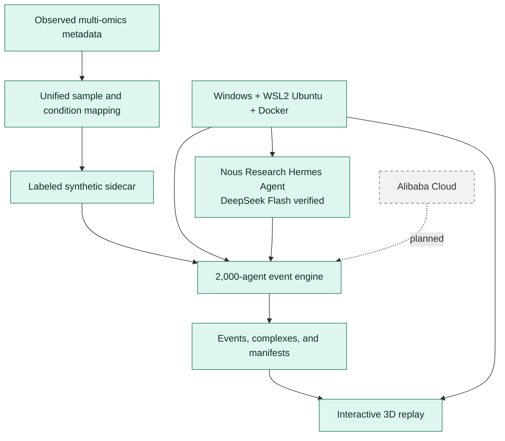

# E. coli Multi-Omics World Model Test Demo

This repository contains source code, configuration, documentation, tests, and
small reproducibility metadata for the E. coli MG1655 multi-omics world-model
Demo.

Raw data, reference snapshots, generated artifacts, credentials, and runtime
logs are intentionally excluded from Git. The canonical large-data location is
the project data tree outside this repository or an object-storage bucket.

## Start here

- [System architecture and review map](docs/SYSTEM_ARCHITECTURE.md)
- [Documentation index](docs/README.md)
- [New conversation handoff](docs/NEW_CONVERSATION_CONTEXT.md)
- [Current deployment status](docs/DEPLOYMENT_STATUS.md)
- [Hermes Agent in WSL](docs/HERMES_WSL.md)
- [Portable infrastructure guide](docs/PORTABLE_INFRASTRUCTURE.md)

## System at a glance



The detailed component, provenance, deployment, and rollback maps are in
`docs/SYSTEM_ARCHITECTURE.md`.

## Repository boundaries

- Tracked here: source code, schemas, small fixtures, configuration templates,
  infrastructure automation, operations documentation, and data manifests that
  do not contain restricted payloads.
- Not tracked here: FASTQ, PRIDE files, MetaboLights payloads, model
  checkpoints, OSS mirrors, private keys, API tokens, and generated logs.
- Local project data: `D:\CodexApp\Project13\EcoliOmics`
- Local Git repository: `D:\CodexApp\Project13\Git`
- Local deployment logs: `D:\CodexApp\Project13\Git\logs`

## Current local status

- Windows version remains Windows 10 Home 22H2 build 19045.
- Microsoft WSL runtime `2.7.14` and Linux kernel `6.18.33.2` are installed.
- Ubuntu `24.04` is registered as `Ubuntu-24.04` with its VHDX on D:.
- Git `2.43.0`, Python `3.12.3`, and `uv 0.12.17` are available in Ubuntu.
- Docker Desktop `4.91.0` with Engine `29.8.0` is installed on D: and
  integrated with `Ubuntu-24.04`.
- Nous Research Hermes Agent `v0.21.4` is installed in Ubuntu with its CLI,
  browser/computer-use tools, memory, cron, and skills. It uses provider
  `deepseek`, model `deepseek-flash`, and has passed inference and terminal-tool
  smoke tests.
- Docker pulls use the local Clash Verge HTTP proxy at
  `http://127.0.0.1:7897`.
- Ubuntu loads a generated proxy block from `~/.bashrc`; the source template
  and idempotent installer are under `infra/wsl/`.
- Windows Firewall allows only `172.16.0.0/12` to reach the Clash mixed port,
  and system proxy/TUN mode are not required.
- `hello-world` has been pulled and run successfully from Ubuntu.
- `origin` and the local `backup` remote are configured and synchronized.

## Infrastructure sequence

For an already configured machine:

1. Start Clash Verge so port `7897` is listening before pulling images.
2. Run `Run-Infrastructure.cmd`; it self-elevates, bypasses the PowerShell
   execution-policy error, and runs the idempotent infrastructure sequence.
3. Review the newest files under `logs` and `logs/last-verification.json`.
4. Start the installed Nous Research Hermes Agent and run the documented
   DeepSeek Flash smoke test.
5. Deploy the Alibaba Cloud CPU control plane before enabling GPU workers.

See `docs/INFRASTRUCTURE.md` for the complete topology and
`docs/LOGGING_AND_ROLLBACK.md` for recovery instructions. Current progress is
recorded in `docs/DEPLOYMENT_STATUS.md`. New Codex conversations should begin
with `docs/NEW_CONVERSATION_CONTEXT.md`. Docker and GitHub network rules are
documented in `docs/NETWORK_AND_PROXY.md`. Hermes installation and operation
are documented in `docs/HERMES_WSL.md`.

## Minimal simulation

The first CPU-only simulation loop is implemented under `src/ecoli_world` with
five schemas under `schemas/`. It exercises 2,000 synthetic agents through
spatial hashing, neighborhood discovery, an event queue, and `NO_EFFECT`,
`MODIFY`, and `BIND` outcomes.

```bash
cd /mnt/d/CodexApp/Project13/Git
PYTHONPATH=src python3 -m ecoli_world.cli \
  --agents 2000 \
  --steps 80 \
  --seed 42 \
  --output artifacts/simulation_mvp
```

See `docs/SIMULATION_MVP.md` for the architecture and test command.

## Condition mapping

The condition mapping layer assigns stable `unified_sample_id` values to source
samples and `condition_id` values to normalized condition signatures. It keeps
observed fields, evidence, confidence, and conflicts separate from any later
synthetic gap filling.

See `docs/CONDITION_MAPPING.md` for the mapping rules and the resumable ENA
BioSample fetch command.

## Condition-aware Demo

`src/ecoli_world/demo_pipeline.py` generates a clearly labeled synthetic
condition sidecar, selects a deterministic Demo cohort, attaches the resulting
sample and condition IDs to all 2,000 agents, and runs the event engine.

See `docs/SYNTHETIC_CONDITIONS.md` for the run command and provenance rules.

## Interactive Demo replay

Every successful condition-aware Demo run exports a self-contained replay
viewer next to its generated artifacts:

```text
EcoliOmics/integrated/condition_completion/demo_full/
  visualization/demo_visualization.html
```

Open the HTML through a local HTTP server so the browser can load the companion
JavaScript files. The viewer renders the cell envelope and all 2,000 agents in
3D, with play/pause, stepping, timeline navigation, outcome highlighting,
condition/origin/source color modes, and agent inspection.

The generated viewer and its large `demo_visualization_data.js` payload remain
local artifacts. The reusable HTML template and licensed browser dependencies
are versioned under `visualizations/`.

## Git workflow

```powershell
Set-Location D:\CodexApp\Project13\Git
git status
git add .
git commit -m "Bootstrap project infrastructure"
git push -u origin main
```

The configured `origin` is
`https://github.com/PrzmArk77469/E.coli-Multi-Omics-World-Model-Test-Demo.git`.
A local rollback remote named `backup` points to
`D:\CodexApp\Project13\GitBackup.git`.
