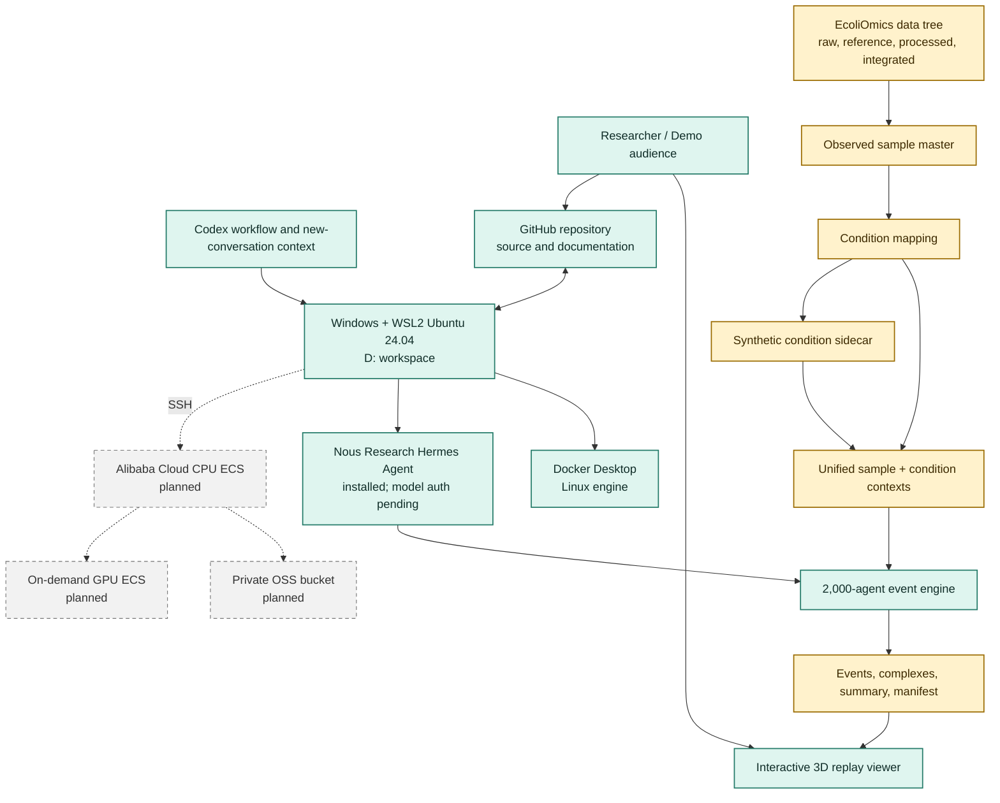
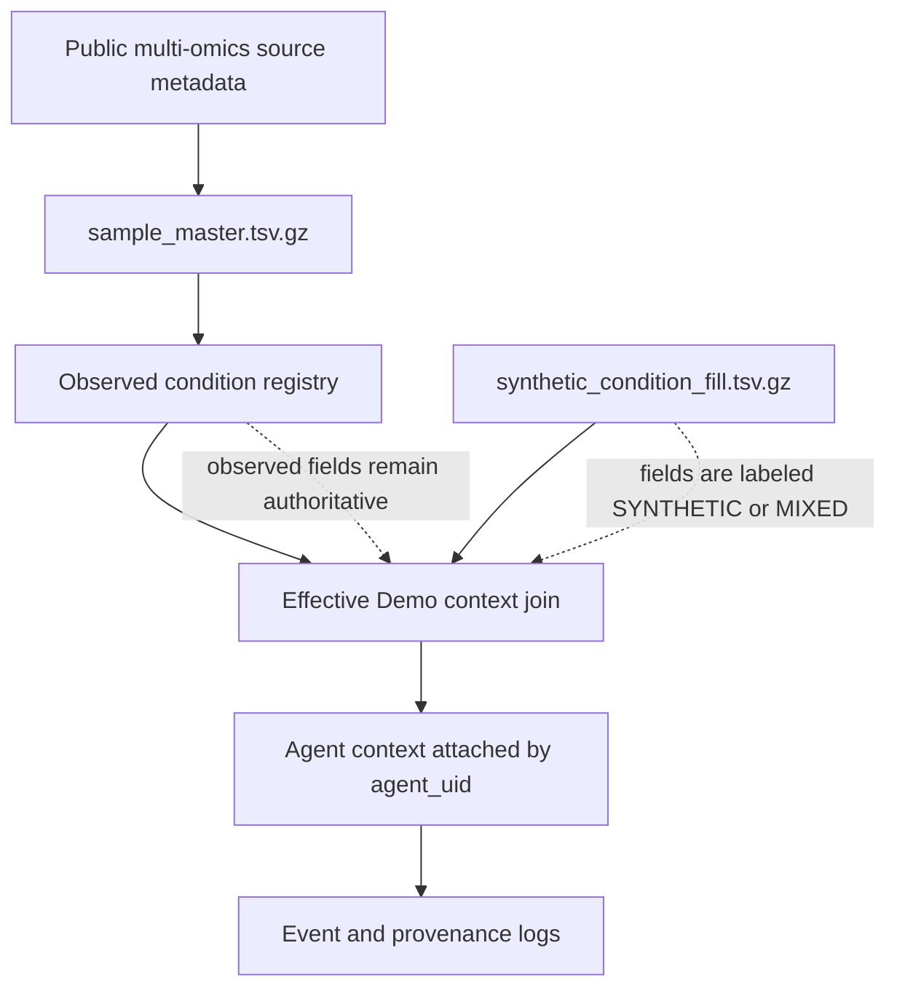
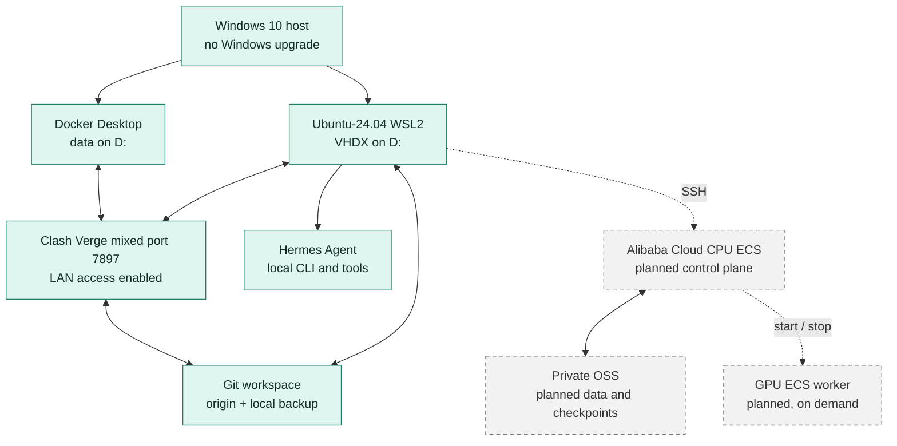

# System Architecture

Last updated: 2026-09-22

## 1. Purpose

This repository is an engineering test Demo for an E. coli MG1655 multi-omics
world-model workflow. It validates the complete path from observed metadata,
through condition mapping and agent simulation, to event logging and
interactive replay.

The current implementation is intentionally a workflow proof. Synthetic
agents, rules, positions, and missing condition values are not calibrated
biological predictions.

## 2. System overview

Solid nodes are implemented and locally verified. Dashed nodes are planned
extensions and must not be treated as deployed infrastructure. Hermes is
installed locally, but model authentication is still pending.



## 3. End-to-end execution


The verified seed-42 run produces:

| Metric | Value |
|---|---:|
| Source rows | 602,778 |
| Demo contexts | 2,000 |
| Conditioned agents | 2,000 |
| Unique effective conditions | 415 |
| Events | 58,558 |
| `NO_EFFECT` | 57,928 |
| `MODIFY` | 393 |
| `BIND` | 237 |
| Complexes | 237 |

## 4. Data and provenance boundary

Observed and synthetic data are separate authorities. A generated value never
overwrites an observed field.



Important identifiers:

- `unified_sample_id` identifies one source record.
- `condition_id` identifies one normalized medium/genotype/treatment/timepoint
  signature and excludes replicate.
- `data_origin` distinguishes `OBSERVED`, `MIXED`, and `SYNTHETIC`.

## 5. Runtime and deployment topology



The local repository path stays `D:\CodexApp\Project13\Git` because the
infrastructure scripts and logs reference it. Renaming the GitHub repository
does not require renaming this stable local directory.

## 6. Component responsibilities

| Component | Responsibility | Current state |
|---|---|---|
| `src/ecoli_world/conditions.py` | Normalize observed fields and build stable IDs | Implemented |
| `src/ecoli_world/synthetic_conditions.py` | Generate isolated, deterministic gap-filling sidecar | Implemented |
| `src/ecoli_world/engine.py` | Run agents through the event engine | Implemented |
| `src/ecoli_world/spatial.py` | Uniform spatial hash and neighborhood discovery | Implemented |
| `src/ecoli_world/events.py` | Priority event queue | Implemented |
| `schemas/` | Five versioned entity contracts | Implemented |
| `src/ecoli_world/visualization.py` | Export compact replay data and local viewer | Implemented |
| `visualizations/demo_engine.html` | Interactive Three.js replay interface | Implemented |
| `infra/windows/` | WSL, Ubuntu, Docker installation and verification | Implemented locally |
| `infra/wsl/` | Ubuntu bootstrap and proxy configuration | Implemented locally |
| Nous Research Hermes Agent | Agent-assisted planning and orchestration | Installed; model authentication pending |
| Alibaba Cloud | CPU control plane, private OSS, on-demand GPU | Planned |

## 7. Repository map

```text
README.md                       Project landing page and quick start
AGENTS.md                       Repository-level agent operating rules
docs/
  README.md                     Documentation index
  SYSTEM_ARCHITECTURE.md        This system map and review guide
  *.md                          Runtime, data, network, and status documents
  project/                      Original designs and feasibility studies
schemas/                        Five simulation entity schemas
src/ecoli_world/                Python simulation and condition-mapping code
tests/                          Unit and end-to-end tests
infra/windows/                  Windows and Docker setup scripts
infra/wsl/                      Ubuntu bootstrap, proxy, and Hermes scripts
metadata/download_queue/        Small reproducibility manifests
visualizations/                 Replay and architecture HTML assets
```

Git tracks source, contracts, automation, small metadata, and documentation.
It does not track:

- `EcoliOmics/raw`, `reference`, `processed`, and `integrated` payloads;
- model checkpoints and generated replay payloads;
- credentials, keys, runtime logs, and temporary files.

## 8. Verification and rollback

The current verified baseline uses Ubuntu 24.04 WSL and passes:

```bash
cd /mnt/d/CodexApp/Project13/Git
PYTHONPATH=src python3 -m unittest discover -s tests -v
```

Result: 16 tests pass, including the 2,000-agent end-to-end condition Demo.

Runtime evidence is stored locally under `logs/` and includes infrastructure
verification plus `condition-demo-42.json` hashes and outcome totals. The local
`backup` remote provides an additional rollback point independent of GitHub.
Hermes `v0.21.4` passes core dependency, tool, and configuration diagnostics.
Its remaining actionable item is model authentication; SQLite and optional
tool warnings are non-blocking.

## 9. Review checklist

1. Confirm that observed metadata enters through `sample_master.tsv.gz`.
2. Confirm that observed and synthetic fields remain separately traceable.
3. Confirm that every agent receives a stable condition context.
4. Confirm that the event engine emits all three required outcomes.
5. Confirm that summary, manifest, event log, and replay payload agree.
6. Treat all current simulation positions and rules as engineering fixtures.
7. Keep the verified simulation baseline intact while Hermes is connected to a
   hosted model provider.
8. Add Alibaba Cloud and bulk ENA retrieval only after preserving this verified
   local baseline.

## 10. Next milestones

1. Rename and maintain the canonical GitHub repository.
2. Authenticate the installed Hermes Agent and run a repository-scoped smoke
   task.
3. Connect Hermes to the remote execution model after local authentication is
   verified.
4. Provision the Alibaba Cloud CPU control plane and private OSS bucket.
5. Expand ENA BioSample retrieval and reduce synthetic condition coverage.
6. Add a GPU worker only for a measured model-training or inference workload.
