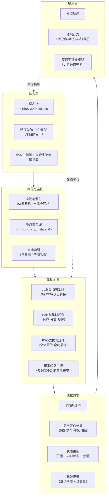
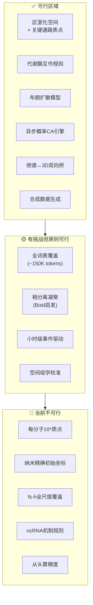

# 三维信息空间·质点模型·元胞自动机 —— 辅助中间系统的可行性论证

> **撰写日期**：2026-07-24
> **主题**：在词表→频谱映射完成后，构建一个密度/精度适当的三维信息空间，将生物分子元件理想化为质点，根据结构生物学与发育生物学知识排布，引入元胞自动机（含Boid/PSO类算法）驱动系统演化——该辅助中间系统的科学、工程与集成可行性分析
> **关联报告**：
> - `虚拟细胞信息空间与AI动态仿真_可行性论证与核心挑战.md`
> - `生物分子词表到频谱空间的映射方法.md`
> **适用范围**：本报告可作为新建任务或项目的背景知识参考，供模型调取阅读

---

## 目录

1. [问题定义与系统架构设想](#1-问题定义与系统架构设想)
2. [前置成果回顾：我们已有什么](#2-前置成果回顾我们已有什么)
3. [科学可行性：知识基础是否支撑质点排布与规则定义](#3-科学可行性知识基础是否支撑质点排布与规则定义)
4. [工程可行性：计算规模、数据流与存储](#4-工程可行性计算规模数据流与存储)
5. [与频谱架构的集成可行性](#5-与频谱架构的集成可行性)
6. [方法学对齐：元胞自动机 / Boid / PSO 对生物分子系统的适用性](#6-方法学对齐元胞自动机--boid--pso-对生物分子系统的适用性)
7. [核心挑战的分层剖析](#7-核心挑战的分层剖析)
8. [可行范围与不可行范围：一张边界地图](#8-可行范围与不可行范围一张边界地图)
9. [推荐路线：分阶段构建方案](#9-推荐路线分阶段构建方案)
10. [总结判断](#10-总结判断)

---

## 1. 问题定义与系统架构设想

### 1.1 问题描述

在前两份报告中，我们完成了：

- **报告一**（`虚拟细胞信息空间与AI动态仿真_可行性论证`）：论证了从DNA序列穷举所有分子元件不可行、但通过因果过滤构建~150K-200K规模的"词表"基本可行，并识别了虚拟细胞模型的六层核心挑战。
- **报告二**（`生物分子词表到频谱空间的映射方法`）：提出了六种将词表token从"文本空间"映射到"频谱空间"的方法，并推荐了"图傅里叶→Koopman→物理先验→稀疏字典→小波→频域卷积"的三阶段流水线。

本报告探讨的**第三步补充工作**是：

> 构建一个**三维信息空间**（密度和精度适当），将词表中的生物分子元件**理想化为质点**，根据结构生物学和发育生物学知识将质点**排布到三维空间中**，形成一个较高精度的三维模型。
>
> 每个质点至少携带：**分子元件标识、XYZ空间位置、时间戳**。
>
> 引入**元胞自动机机制**（可参考Boid算法、粒子群优化PSO等），让每个质点遵循**独立且概率性的规则**（规则随知识库更新而变化，引入不确定性），与周围分子元件发生互作，**推动系统整体演化**。
>
> 本报告论证：这样的一个**支持性、辅助性中间系统**是否可行。

### 1.2 系统架构设想



### 1.3 本系统的定位

在整体虚拟细胞模型架构中，本系统处于**中间层**：

```
层 1: 词表 + 频谱签名（已完成 / 报告二）
        ↓
层 2: ★ 三维质点-元胞自动机中间系统（本报告探讨）★
        ↓
层 3: AI驱动的全细胞动态仿真（远期目标 / 报告一）
```

其角色是**桥梁**——连接抽象的频谱符号空间与具体的时空动力学仿真，为上层AI模型提供物理上合理的"沙盒"和先验约束。

---

## 2. 前置成果回顾：我们已有什么

在论证新系统的可行性之前，先确认已有的基础：

| 前置资产 | 内容 | 对三维系统的支撑 |
|----------|------|:---:|
| **词表 𝒱** | ~150K-200K 生物分子token（mRNA、蛋白质、miRNA、代谢物等） | 提供质点**类型集合** |
| **频谱签名 Φ(t)** | 每个token的复数频谱向量 ∈ ℂᵈ | 提供质点的**行为指纹**（幅度=活性强度，相位=因果相位） |
| **图结构 𝒢** | 分子互作网络（蛋白-蛋白、TF-靶基因、miRNA-mRNA等） | 提供质点间的**先验互作拓扑**（谁与谁可能发生互作） |
| **物理先验** | 化学计量比、热力学约束、守恒律（来自报告二的M6方法） | 提供规则的**硬约束边界** |
| **六层挑战认知** | L1知识缺陷 / L2建模困难 / L3数据不足 / L4 AI局限 / L5评价困难 / L6工程限制 | 提供系统设计的**风险地图** |
| **Koopman模式** | 动力学系统的线性化频谱模式（来自报告二的M5方法） | 提供**粗粒化演化趋势**的先验 |

> **关键判断**：已有基础对"类型级别"（token type level）的描述相当充分，但三维质点系统需要的是"实例级别"（molecule instance level）的描述——这是**整个论证中最核心的张力**。

---

## 3. 科学可行性：知识基础是否支撑质点排布与规则定义

### 3.1 质点排布的空间知识

#### 3.1.1 什么是已知的

| 知识类别 | 已知程度 | 可支撑的排布精度 |
|----------|:---:|:---:|
| **细胞器/亚细胞区室定位** | ✅ 高 | 可将质点分配到核、质、ER、线粒体、高尔基体等区室 |
| **大分子复合物结构** | ✅ 高（Cryo-EM/晶体学） | 核糖体（~80S）、蛋白酶体（~26S）、核孔复合物（~120 MDa）的三维结构精确到Å级 |
| **细胞骨架网络拓扑** | 🟡 中 | 微管（~25 nm直径）、微丝（~7 nm）的总体组织模式已知，但具体连接拓扑是动态的 |
| **相分离凝聚体** | 🟡 中 | 核仁、应力颗粒、P颗粒等的位置和组分已知，但精确边界模糊 |
| **膜域组织** | 🟡 中 | 脂筏、紧密连接、黏附连接的位置已知，但动态重组规则不明 |
| **代谢通道** | 🟠 低 | 多酶复合物（如嘌呤体、脂肪酸合酶）的胞内定位数据稀疏 |
| **单个蛋白质的胞内精确坐标** | 🔴 极低 | 绝大多数蛋白质的实时纳米级三维坐标是未知的 |

> **核心约束**：我们可以说"核糖体主要分布在粗面ER胞质面和细胞质中"，但无法给出单个核糖体在某一时刻的精确(x, y, z)。这意味着**初始排布只能是统计性的、概率性的，而非确定性的**。

#### 3.1.2 发育生物学知识的可用性

发育生物学提供的是**细胞群体层面**的组织模式（梯度、极性、分层），而非单个分子元件的坐标。例如：

- **形态发生素梯度**（Bicoid、Hedgehog、Wnt、BMP）：可用于设置质点的**宏观浓度场**约束
- **细胞极性轴**（apical-basal, planar cell polarity）：可用于**定向**部分质点（如PAR蛋白复合物）
- **命运决定网络**（转录因子层级）：可用于定义质点的**逻辑激活规则**而非空间排布

> **判断**：发育生物学知识对三维质点系统的直接贡献**有限**。它的主要用途是提供**边界条件**和**宏观约束**，而非微观坐标。

### 3.2 规则定义的知识基础

#### 3.2.1 什么是已知的——按分子类别

| 分子类别 | 已知规则 | 规则确定性 | 可转换为元胞自动机规则的程度 |
|----------|------|:---:|:---:|
| **代谢酶** | \(k_{cat}\), \(K_m\), \(k_{on}\)/\(k_{off}\) 对底物/产物 | 🟡 部分已知（BRENDA, SABIO-RK） | ✅ 高——可直接转化为概率反应规则 |
| **转录因子** | 结合位点基序（JASPAR）、ChIP-seq结合谱 | 🟡 基因组位置已知，但结合动力学未知 | 🟡 中等——可定义"靠近DNA→概率结合" |
| **信号激酶** | 磷酸化底物列表（PhosphoSitePlus） | 🟠 底物列表较全，但 \(k_{cat}/K_m\) 数据稀疏 | 🟡 中等——可定义"靠近底物→概率磷酸化" |
| **分子马达** | 步长、速度、方向性（kinesin ~800 nm/s, dynein ~1 μm/s） | 🟡 部分已知 | ✅ 高——非常适配质点运动模型 |
| **核糖体** | 翻译速率（~5 aa/s）、起始/延伸/终止概率 | ✅ 高 | ✅ 高 |
| **分子伴侣** | 客户蛋白列表、ATP依赖构象变化 | 🟠 部分已知 | 🟡 中等 |
| **泛素-蛋白酶体** | 识别信号（degron）、泛素化级联 | 🟡 信号基序已知，动力学部分已知 | 🟡 中等 |
| **miRNA/RISC** | 靶mRNA列表（TargetScan）、抑制强度 | 🟠 靶标预测有高假阳性率 | 🟠 低——规则不确定性高 |
| **lncRNA** | 互作伴侣（蛋白/DNA/RNA） | 🔴 大多数lncRNA功能未知 | 🔴 极低——难以定义规则 |
| **代谢物** | 扩散系数（\(D\) ~10⁻¹⁰-10⁻⁹ m²/s 对小分子） | ✅ 高 | ✅ 高——布朗运动可直接建模 |

#### 3.2.2 "概率规则随知识库更新而变化"

这一设计的含义是：规则不是硬编码的，而是**可被新实验数据修改的参数化概率分布**。这在理论上是优雅的，但引入了一个工程挑战：

- 如果一个规则的更新改变了系统的宏观行为，如何判断"新行为"是更接近真实，还是仅仅是参数漂移？
- 这需要**校准机制**（calibration）和**版本化的规则快照**（versioned rule snapshots），增加了系统复杂度。

> **判断**：规则"可更新"的设计原则是合理的，但这本质上将系统变成了一个**持续校准中的概率图模型**，而非一个"定义好后运行"的模拟。这本身不是问题，但需要被明确认识。

### 3.3 科学可行性的总体判断

| 维度 | 判断 |
|------|------|
| 质点类型标识 | ✅ **完全可行**——词表已定义 |
| 质点空间排布（区室级） | ✅ **可行**——亚细胞定位数据充分 |
| 质点空间排布（纳米级精确坐标） | 🔴 **不可行**——数据根本不存在 |
| 质点运动规则（被动扩散） | ✅ **可行**——扩散系数数据充足 |
| 质点运动规则（主动运输） | 🟡 **部分可行**——分子马达参数已知 |
| 质点互作规则（代谢酶） | ✅ **可行**——酶动力学数据丰富 |
| 质点互作规则（信号转导） | 🟡 **部分可行**——拓扑已知、动力学稀疏 |
| 质点互作规则（基因调控） | 🟠 **勉强可行**——需大量近似和填补 |
| 质点互作规则（ncRNA功能） | 🔴 **基本不可行**——知识严重不足 |
| 时间戳记录 | ✅ **完全可行**——工程上简单 |

---

## 4. 工程可行性：计算规模、数据流与存储

### 4.1 规模估算

这是整个可行性论证中**最关键的定量分析**。

#### 4.1.1 一个人类细胞的分子数量

| 分子类型 | 每个细胞的拷贝数 | 数据来源 |
|----------|:---:|------|
| 水分子 | ~4 × 10¹⁰ | — |
| 蛋白质（总） | ~2-4 × 10⁹ | Milo 2013, BioNumbers |
| 代谢物（总） | ~1-3 × 10⁸ | Milo 2013 |
| mRNA（总） | ~3-6 × 10⁵ | Milo 2013 |
| tRNA | ~3 × 10⁶ | BioNumbers |
| 脂质（膜） | ~5 × 10⁹ | Milo 2013 |
| ATP | ~1-5 × 10⁹ | BioNumbers |
| 核糖体 | ~1-5 × 10⁶ | Milo 2013 |

> **核心瓶颈**：如果为每个蛋白质分子创建一个质点，需要模拟 **~10⁹ 个质点**。

#### 4.1.2 更务实的规模：粗粒化后

如果不追求每分子建模，而是采用粗粒化策略：

| 粗粒化策略 | 质点数 | 说明 |
|-----------|:---:|------|
| **每分子建模** | ~10⁹-10¹⁰ | 蛋白质+代谢物+RNA。**不可行** |
| **超粒子（super-particle）**：1个质点代表100-1000个同类分子 | ~10⁶-10⁷ | 保留了空间异质性，减少了计算量 |
| **区室平均**：每个区室每种分子一个浓度值 | ~10⁴-10⁵ | 丢失了空间细节，但计算上非常可行 |
| **混合方案**：高丰度分子用浓度场，低丰度关键分子用质点 | ~10⁴-10⁶ | ✅ **推荐——在精度与计算之间取平衡** |

#### 4.1.3 存储估算（混合方案，~10⁶ 质点）

| 数据项 | 单个质点 | × 10⁶ | 每时间步 |
|-------|:---:|:---:|:---:|
| 分子ID（uint32） | 4 B | 4 MB | 4 MB |
| XYZ位置（3×float32） | 12 B | 12 MB | 12 MB |
| 速度向量（3×float32） | 12 B | 12 MB | 12 MB |
| 内部状态（uint8 × 4） | 4 B | 4 MB | 4 MB |
| 频谱签名指针（uint32） | 4 B | 4 MB | 4 MB |
| 时间戳（float64） | 8 B | 8 MB | 8 MB |
| **每时间步总计（压缩前）** | **44 B** | **44 MB** | **44 MB** |

模拟1000步：~44 GB 原始轨迹数据。加上空间索引（八叉树）、邻域列表等辅助结构，总内存占用在 **~8-16 GB** 范围内，单机（高端工作站/云端VM）完全可承载。

#### 4.1.4 计算量估算

**每个时间步的核心计算**：

| 计算 | 算法 | 复杂度（10⁶ 质点） |
|------|------|:---:|
| 空间索引更新 | 空间哈希 / 八叉树 | O(N log N) ≈ 2×10⁷ ops |
| 邻域搜索（r = 10 nm） | 网格法 / Verlet列表 | O(N) ≈ 10⁷-10⁸ ops |
| 质点运动更新（布朗+主动） | O(N) | ~10⁶ ops |
| 互作判定（碰撞+反应） | O(N × ⟨neighbors⟩) | ~10⁸-10⁹ ops |
| 状态转移（规则引擎） | O(N) | ~10⁶-10⁷ ops |

**时间步长约束**：
- 扩散主导系统：Δt ~ (Δx)²/(6D)
- 如果 Δx = 10 nm, D = 10 μm²/s（典型蛋白质），Δt ≈ 1.7 μs
- 模拟1秒生物时间需要 ~6×10⁵ 步
- 模拟1小时生物时间需要 ~2×10⁹ 步——**这不可行**

> **关键约束**：质点级模拟的时间步长受扩散稳定性条件限制，导致覆盖有意义的生物时间（分钟到小时）需要极多的步数。这是**分子动力学模拟几十年来一直面对的经典问题**。

#### 4.1.5 时间步长的缓解方案

| 方案 | 效果 | 代价 |
|------|------|------|
| **事件驱动模拟**（Gillespie / τ-leap） | 跳过无事件的等待时间 | 需要反应 propensity 计算 |
| **多时间尺度积分** | 慢变量大步长，快变量小步长 | 耦合误差 |
| **粗粒化时间**：让1个模拟步代表>1 μs | 大幅减少步数 | 丢失快速过程的细节 |
| **放弃物理时间，改用逻辑时间** | 每个step = 一个"事件纪元" | 不再对应真实物理时间 |

> **推荐**：采用事件驱动（Gillespie类）或逻辑时间方案。——这是微观模拟领域的成熟实践（MCell, Smoldyn）。

### 4.2 空间离散化方案

| 方案 | 内存 | 邻域搜索 | 适用场景 |
|------|:---:|------|------|
| **均匀体素网格** | 网格单元数³ × 指针大小 | O(1) 通过网格坐标 | 密度均匀的系统 |
| **八叉树** | 自适应，~O(N) | O(log N) | 密度非均匀（推荐） |
| **空间哈希** | ~O(N) | O(1) 平均 | 动态质点，频繁插入/删除 |
| **k-d树** | O(N) | O(log N) 平均 | 静态或半静态系统 |
| **Verlet邻域列表** | O(N × ⟨neighbors⟩) | O(1)（增量更新） | 短程互作 |

> **推荐**：**空间哈希 + Verlet列表** 的组合——空间哈希处理全局邻域发现（重建每10-20步），Verlet列表缓存短程邻域（每步增量更新）。

### 4.3 工程可行性的总体判断

| 维度 | 判断 |
|------|------|
| 10⁶ 质点存储 | ✅ **单机轻松承载**（~10 GB RAM） |
| 10⁶ 质点每步计算 | ✅ **单机可实时或近实时**（< 1秒/步 on GPU） |
| 10⁶ 质点 × 10⁶ 步 | 🟡 **需要GPU加速 + 多机并行**（但可行） |
| 10⁹ 质点（每分子） | 🔴 **不可行**——需要超算级别资源且时间步约束使覆盖有意义时间尺度不可能 |
| 空间索引 | ✅ **成熟技术，有大量现成方案** |
| 规则引擎 | ✅ **可设计为数据驱动，计算成本可控** |
| 轨迹存储与回放 | ✅ **~GB级，低成本** |

---

## 5. 与频谱架构的集成可行性

### 5.1 从"类型频谱"到"实例属性"的桥接

报告二中，每个词表token t 获得了一个复数频谱签名 Φ(t) ∈ ℂᵈ。在三维质点系统中，每个质点是 token 的一个**实例**。

桥接策略：

```
Φ(t)  ───分解──→  |Φ(t)| 幅度分量 ──→ 质点活性强度（如酶催化效率缩放因子）
                  ∠Φ(t) 相位分量 ──→ 质点因果相位（如调控事件的时间偏移）
                  Re(Φ(t))       ──→ 质点初始空间偏好向量（如趋向某区室）
                  Im(Φ(t))       ──→ 质点内部状态初始值（如磷酸化概率基线）
```

更精确地说，可以将 Φ(t) 的高维复数向量作为**规则调节器**而非直接作为物理参数：

| 频谱分量的角色 | 如何影响质点 |
|------|------|
| 幅度谱低频分量 | 决定质点在长时间尺度上的**平均活性水平** |
| 幅度谱高频分量 | 决定质点对**快速环境变化的响应灵敏度** |
| 相位谱 | 决定质点与其他质点互作的**时序协调性**（如同步振荡） |
| 频谱间互相关（token i vs token j） | 决定质点间**先验互作倾向**的大小 |

### 5.2 双向信息流设计

```
频谱空间（类型层）                       三维空间（实例层）
      │                                        │
      ├──── Φ(t) → 规则参数 ─────→          质点行为
      │                                        │
      │                                 质点互作统计量
      │                                        │
      ├──── 统计量 → Φ(t) 更新 ←─────   （频率/相位精炼）
```

**上行**（3D→频谱）：从质点轨迹中统计互作频率、共定位模式、时序关联，用于精炼 Φ(t) 的幅度和相位。

**下行**（频谱→3D）：更新后的 Φ(t) 调整下一轮模拟中的质点规则参数。

> **判断**：这种双向闭环在架构上是优雅的，但需要警惕**正反馈漂移**——如果更新规则设计不当，系统可能偏离物理真实而自洽地收敛到一个非物理状态。需要**物理约束作为更新边界**（如报告二中M6方法的PINN约束）。

### 5.3 与六层挑战的对应关系

三维质点系统对各层挑战的影响：

| 挑战层 | 三维质点系统的作用 |
|------|------|
| L1 知识缺陷 | ❌ **不解决**——仍然需要已知参数来定义规则 |
| L2 建模困难 | ✅ **部分解决**——提供了一个多尺度、空间显式的统一模拟框架 |
| L3 数据不足 | ✅ **部分改善**——模拟可生成合成训练数据，填补扰动组合的空隙 |
| L4 AI根本局限 | ✅ **显著改善**——物理空间约束防止输出非物理结果 |
| L5 评价困难 | ✅ **改善**——可定义空间精度、守恒律违反度、模式匹配度等指标 |
| L6 工程限制 | 🟡 **基本不变**——增加了新系统，但总计算量可控 |

---

## 6. 方法学对齐：元胞自动机 / Boid / PSO 对生物分子系统的适用性

### 6.1 元胞自动机（Cellular Automaton, CA）

#### 6.1.1 经典CA的特点

- 离散空间（格点），离散时间，离散状态
- 每个格点的下一状态仅取决于其**局部邻域**的当前状态
- 规则是**确定性的**或**简单概率性的**

#### 6.1.2 对生物分子系统的适用性

| CA特性 | 生物分子系统 | 对齐度 |
|--------|-------------|:---:|
| 离散空间格点 | 分子在连续空间中运动 | 🟠 需离散化，丢失亚格点精度 |
| 局部邻域规则 | 分子仅与近邻分子直接互作 | ✅ **完美对齐** |
| 同步更新 | 分子事件是异步的 | 🟠 需改为异步/事件驱动更新 |
| 简单状态 | 分子有多维内部状态 | 🟠 需扩展为"向量CA"或"概率CA" |
| 确定规则 | 分子事件本质上是概率的 | 🟠 需改为概率CA（已有成熟扩展） |

#### 6.1.3 成功的先例

- **反应-扩散CA模型**：已成功用于斑图形成（如斑马条纹、手指花纹），证明了CA范式对生化系统的适用性
- **Lattice Boltzmann方法**：在连续极限下恢复Navier-Stokes方程，展示了格点模型可以逼近连续物理
- **Cellular Potts模型**（CompuCell3D）：用扩展CA模拟细胞行为，已在发育生物学中广泛使用

> **判断**：元胞自动机范式对生物分子系统**总体适用**，但需要从"经典二进制CA"升级为"带连续位置的向量概率CA"（参见6.4节综合方案）。

### 6.2 Boid算法

#### 6.2.1 经典Boid的三条规则

1. **分离（Separation）**：避免与邻近个体碰撞
2. **对齐（Alignment）**：与邻近个体的平均方向保持一致
3. **凝聚（Cohesion）**：向邻近个体的平均位置靠拢

#### 6.2.2 对生物分子系统的适用性

| Boid规则 | 生物分子类比 | 对齐度 |
|----------|-------------|:---:|
| 分离 | 排除体积效应（分子不能重叠） | ✅ **直接对应** |
| 对齐 | 分子马达沿微管的定向运动 | 🟡 部分适用——大多数分子不"对齐"，但细胞骨架上的定向运输例外 |
| 凝聚 | 相分离（液-液相分离形成凝聚体） | ✅ **惊人地适用**——弱多价互作驱动的凝聚与Boid凝聚规则有深刻的数学同源性 |

#### 6.2.3 扩展Boid规则建议

为生物分子系统定制Boid类规则：

| 新规则 | 生物物理含义 | 数学形式（建议） |
|--------|-------------|------|
| **结合（Binding）** | 特异性互作（酶-底物、TF-DNA、抗体-抗原） | 距离依赖的概率：\(P_{\text{bind}} = P_0 \cdot e^{-r/r_0} \cdot f(\text{complementarity})\) |
| **催化（Catalysis）** | 酶促转化 | 状态转移：若底物质点在酶质点邻域内，底物状态→产物状态，概率 ∝ \(k_{cat}\) |
| **降解（Degradation）** | 蛋白/RNA降解 | 每个质点在每个时间步有概率 \(p_{\text{degrade}}\) 被移除 |
| **合成（Synthesis）** | 转录/翻译 | 在特定位置（DNA位点/核糖体）以概率 \(p_{\text{synthesize}}\) 创建新质点 |
| **排斥体积（Excluded Volume）** | 分子不可重叠 | 软球势或Lennard-Jones排斥项 |
| **趋化（Chemotaxis）** | 沿浓度梯度运动 | 速度偏向梯度方向：\(\mathbf{v} \leftarrow \mathbf{v} + \alpha \nabla C\) |

> **判断**：Boid范式对分子系统是**创新性的、富有启发的类比**，但不能直接套用——需要从根本上重建规则集。

### 6.3 粒子群优化（Particle Swarm Optimization, PSO）

#### 6.3.1 经典PSO的特点

- 每个粒子记忆自己的历史最优位置（`pbest`）
- 群体共享全局最优位置（`gbest`）
- 速度更新 = 惯性 + 向`pbest`的认知分量 + 向`gbest`的社会分量

#### 6.3.2 对生物分子系统的适用性

PSO的核心是**优化一个目标函数**。生物分子系统本身并**不是**在"优化"什么——它只是在遵循物理定律。但可以巧妙地将PSO范式**重新解释**：

| PSO概念 | 生物分子重解释 | 适用性 |
|---------|---------------|:---:|
| `pbest`（个体最优） | 分子的**最低自由能构象**（热力学稳定状态） | ✅ 物理上合理 |
| `gbest`（全局最优） | 系统的**热力学平衡态**或**稳态吸引子** | ✅ 合理——系统趋向自由能最小化 |
| 速度更新 | 分子在热浴中的**Langevin动力学** | ✅ 已有完备的物理理论（涨落-耗散定理） |
| 目标函数 | **自由能景观**（free energy landscape） | ✅ 统计力学基础概念 |

> **判断**：PSO范式可以作为一种**计算启发式**来加速寻找稳态构型，但不适合作为动力学模拟的基础——真正的分子动力学由Langevin方程描述，其与PSO的数学形式有相似之处但物理含义截然不同。**不建议将PSO作为核心动力学引擎，但可借鉴其"吸引子"概念用于稳态分析**。

### 6.4 综合推荐：混合计算范式

```
核心引擎:    向量概率元胞自动机（异步更新）
              +
质点运动:    Langevin动力学（布朗运动 + 主动力 + 排除体积）
              +
集群行为:    Boid启发规则（相分离凝聚 + 定向运输）
              +
稳态分析:    PSO启发吸引子搜索（寻找自由能极小值）
              +
全局约束:    反应-扩散偏微分方程（浓度场连续极限）
```

---

## 7. 核心挑战的分层剖析

回到报告一的六层挑战框架，分析三维质点系统在每一层面临的**新挑战**：

### 7.1 L1：知识缺陷（重新评估）

| 子挑战 | 对三维质点系统的影响 | 严重度 |
|--------|------|:---:|
| 多数 \(k_{on}\)/\(k_{off}\) 未测量 | 互作规则需要这些参数 | 🔴 根本性 |
| 单个蛋白的胞内精确定位未知 | 初始排布必须依赖统计/随机 | 🔴 根本性 |
| lncRNA和大量ncRNA功能未知 | 无法为这些token定义有意义的规则 | 🔴 根本性 |
| 翻译后修饰的组合效应未知 | 质点内部状态空间爆炸 | 🟠 严重 |

### 7.2 L2：建模困难（重新评估）

| 子挑战 | 应对策略 | 严重度 |
|--------|------|:---:|
| 多尺度耦合（fs→h） | 事件驱动 + 粗粒化时间。见4.1.5 | 🟡 有缓解方案 |
| 随机性与确定性平衡 | Langevin框架天然包含随机项 | 🟢 好处理 |
| 连续-离散混合 | 质点（离散）+ PDE浓度场（连续）= 混合方法 | 🟡 有成熟方案（如Wiley 2009混合MC-PDE） |

### 7.3 L3：数据不足（新的机会）

三维质点系统实际上**创造了新的数据来源**：
- 可生成扰动后的空间重排数据
- 可生成罕见事件的轨迹样本
- 可作为数据增强管道：真实数据 + 模拟数据 → 训练AI模型

> **判断**：三维系统在L3上不是受害者，而是**部分解决者**——它本身就是一个可控的合成数据生成器。

### 7.4 L4：AI根本局限（新的保障）

三维质点系统为上层AI提供了**物理沙盒约束**：
- 如果AI预测"分子A激活分子B"，可先在三维系统中验证该预测是否与空间可达性、扩散速率相容
- 频谱签名 Φ(t) 的精炼经由三维系统的物理模拟反馈，而非纯统计推断

> **判断**：三维系统是应对L4挑战的**核心武器**——它为因果推断提供了物理可解释性的底座。

### 7.5 L5：评价困难（新的指标）

三维质点系统提供了新的客观评估维度：

| 指标 | 定义 | 可量化性 |
|------|------|:---:|
| 空间排布精度 | 模拟的分子空间分布 vs 成像数据（如MERFISH、seqFISH） | ✅ 高（Wasserstein距离） |
| 互作频率保真度 | 模拟中A-B互作次数 vs Co-IP/MS实验数据 | ✅ 高（相关系数） |
| 动力学一致性 | 模拟的浓度时间序列 vs 活细胞成像 | ✅ 高（DTW距离） |
| 守恒律违反度 | 质量/电荷/能量不守恒的程度 | ✅ 完美（应为0） |
| 涌现模式匹配 | 模拟的斑图 vs 真实生物斑图（如Min系统振荡） | 🟡 可设计但需标准数据 |

### 7.6 L6：工程限制（可接受）

如第4节分析，在粗粒化到10⁶质点的混合方案下，工程约束**可接受**。

---

## 8. 可行范围与不可行范围：一张边界地图

### 8.1 明确可行的

| 目标 | 置信度 | 说明 |
|------|:---:|------|
| 构建具有区室化结构的三维信息空间（核-质-细胞器等） | ✅ 高 | 成熟知识 |
| 选取100-1000个关键分子种类，每类10³-10⁴个质点 | ✅ 高 | 计算可控 |
| 为代谢酶定义基于 \(k_{cat}\)/\(K_m\) 的概率互作规则 | ✅ 高 | BRENDA等数据库提供数据 |
| 为扩散主导的过程实现布朗运动质点模型 | ✅ 高 | 成熟算法 |
| 实现异步概率元胞自动机规则引擎 | ✅ 高 | 已有参考实现 |
| 记录完整轨迹并计算统计量 | ✅ 高 | 工程简单 |
| 与频谱签名建立双向信息流 | ✅ 高 | 架构清晰 |
| 生成合成数据以增强AI模型训练 | ✅ 高 | 可控生成 |
| 单机或单GPU运行（10⁶质点规模） | ✅ 高 | 见第4节计算 |

### 8.2 原则可行的（需非平凡工程努力）

| 目标 | 置信度 | 关键障碍 |
|------|:---:|------|
| 覆盖全部150K token类型 | 🟡 中 | 大部分ncRNA功能未知，无法定义规则 |
| 实现Boid启发的相分离凝聚 | 🟡 中 | 弱多价互作参数需校准 |
| 事件驱动时间步进覆盖小时级生物时间 | 🟡 中 | 事件率估计的精度依赖先验数据 |
| GPU加速到10⁷质点 | 🟡 中 | 不规则邻域搜索在GPU上实现复杂 |
| 与seqFISH/MERFISH空间组学数据校准 | 🟡 中 | 数据获取和配准是工程挑战 |

### 8.3 当前不可行的

| 目标 | 置信度 | 根本原因 |
|------|:---:|------|
| 每分子建模（10⁹-10¹⁰质点） | 🔴 极低 | 计算-存储-时间步约束构成"不可能三角" |
| 纳米级精确初始坐标 | 🔴 极低 | 数据不存在，原则上也无法获取 |
| 覆盖 fs-μs 级快速过程的同时覆盖小时级慢过程 | 🔴 极低 | 时间尺度的物理鸿沟，已知的科学难题 |
| lncRNA和piRNA的基于机制的质点规则 | 🔴 极低 | 功能未知 |
| 机械论精度（从头算分子动力学精度） | 🔴 极低 | 经典力场本身是近似，量子效应被忽略 |

### 8.4 边界地图（可视化）



---

## 9. 推荐路线：分阶段构建方案

### 9.1 阶段0：最小可行原型（MVP）—— 2-3个月

| 组件 | 内容 | 规模 |
|------|------|:---:|
| **空间** | 球形细胞，3个区室（核、质、膜），体素分辨率 ~50 nm | ~10³ 体素 |
| **质点** | 20种关键token，每类100个质点 | ~2,000 质点 |
| **规则** | 布朗扩散 + 简单绑定/解离规则（代谢酶 + 1条信号通路） | ~30条规则 |
| **时间** | 逻辑时间步，模拟~1000步 | — |
| **输出** | 质点轨迹 + 浓度热图 + 互作频率矩阵 | — |

**目标**：验证整个流水线（词表→频谱→三维排布→规则驱动→轨迹输出→反馈）的技术可行性。

### 9.2 阶段1：核心通路扩展 —— 6-12个月

| 组件 | 内容 | 规模 |
|------|------|:---:|
| **空间** | 添加细胞器（ER、线粒体、高尔基体），分辨率 ~20 nm | ~10⁴-10⁵ 体素 |
| **质点** | 200-500种token，每类10²-10³个质点 | ~10⁴-10⁵ 质点 |
| **规则** | 3-5条核心信号通路 + 中心代谢 + 转录/翻译循环 | ~200条规则 |
| **时间** | 事件驱动（Gillespie类），覆盖~分钟级生物时间 | — |
| **输出** | 与公开空间组学/活细胞成像数据的交叉验证 | — |

**目标**：生成有生物学意义的模拟数据，开始与实验数据校准。

### 9.3 阶段2：规模化与频谱集成 —— 1-2年

| 组件 | 内容 | 规模 |
|------|------|:---:|
| **空间** | 自适应分辨率（稠密区细、稀疏区粗） | ~10⁶ 体素 |
| **质点** | 2000-5000种token | ~10⁶ 质点 |
| **规则** | 概率规则知识库（~2000条），支持在线更新 | — |
| **频谱集成** | 双向闭环：Φ(t)→规则参数，轨迹统计→Φ(t)精炼 | — |
| **运行** | GPU加速，单机或小集群 | — |

**目标**：系统可作为上层AI模型的"物理沙盒"，定期生成合成数据。

---

## 10. 总结判断

### 10.1 核心问题的回答

> **"这样一个支持性、辅助性中间系统的建立是可行的吗？"**

**回答：在恰当限定的范围内，是可行的；在无约束的完整尺度下，是不可行的。**

具体而言：

| 问题维度 | 判断 | 置信度 |
|----------|------|:---:|
| 构建具有区室化结构的三维信息空间 | ✅ **可行** | 高 |
| 将部分（非全部）词表token理想化为质点 | ✅ **可行** | 高 |
| 根据现有知识对质点进行统计性初始排布 | ✅ **可行**（但不精确） | 高 |
| 为已知功能的分子定义概率性规则 | ✅ **可行**（数据依赖） | 中-高 |
| 引入CA + Boid + PSO混合驱动机制 | ✅ **创新且可行** | 中 |
| 规则随知识库更新而概率性变化 | ✅ **架构可行** | 高 |
| 覆盖全部150K token类型 | 🟡 **原则可行但部分token规则难以定义** | 中 |
| 构建与频谱签名的双向信息流闭环 | ✅ **架构清晰可行** | 高 |
| 在工程上运行（10⁴-10⁶质点规模） | ✅ **完全可行** | 高 |
| 达到可辅助上层AI模型的质量 | ✅ **可行（作为物理沙盒/合成数据源）** | 中-高 |

### 10.2 关键的"不可行边界"

以下目标**不应被设定为本系统的目标**：

1. ❌ **每分子建模**（10⁹+质点）——计算和物理上均不可行
2. ❌ **纳米级绝对精度的初始坐标**——数据不存在
3. ❌ **全尺度时间覆盖**（fs 到 h 在同一模拟中）——物理鸿沟
4. ❌ **功能完全未知的ncRNA的机制性规则**——需等待基础生物学进步
5. ❌ **替代实验验证**——本系统是辅助工具，不能成为唯一真理源

### 10.3 本系统的独特价值

尽管有上述限制，该三维质点系统在一个关键维度上是**不可替代的**：

> 它是连接**抽象频谱符号空间**与**具体时空动力学**的唯一桥梁。频谱签名 Φ(t) 本身是数学对象——它描述的是"可能性空间"。三维质点系统将这些可能性**实例化**到物理空间中，让"如果X与Y相遇于位置Z"不再是假设性的，而是可模拟、可观测的。这正是"辅助中间系统"的核心价值——**为上层AI提供物理可解释的因果校验层**。

### 10.4 最终建议

| 建议 | 说明 |
|------|------|
| **立即启动阶段0 MVP** | 2-3个月，2000质点，20 token，验证技术流水线 |
| **以代谢网络为核心起点** | 代谢酶的数据最丰富、规则最明确、确定性最高 |
| **接受统计性排布为默认** | 放弃纳米精确坐标的幻想，用统计分布+区室约束代替 |
| **采纳混合质点-浓度场方案** | 高丰度分子用PDE浓度场，低丰度关键分子用质点 |
| **将频谱签名作为规则调制器** | 而非直接物理参数——这是两个架构间最自然的接口 |
| **建立与实验数据的校准循环** | 空间组学（MERFISH/seqFISH）+ 活细胞成像作为ground truth锚点 |
| **明确系统的辅助定位** | 它是沙盒、合成数据源和因果校验层——不是完整的虚拟细胞模型 |

---

> **报告完。**
>
> 本报告对"三维信息空间·质点模型·元胞自动机混合驱动"辅助中间系统的科学、工程与集成可行性进行了逐层分析。
> 核心结论：**在粗粒化、统计性排布、关键通路优先的约束下——可行且价值显著；在每分子精确建模的全尺度目标下——不可行。**
> 推荐按三阶段（MVP→核心通路→规模化集成）渐进式构建。
>
> 关联报告：`虚拟细胞信息空间与AI动态仿真_可行性论证与核心挑战.md`、`生物分子词表到频谱空间的映射方法.md`

