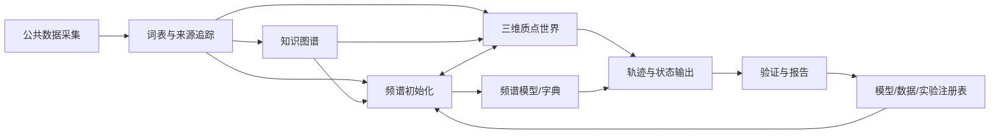
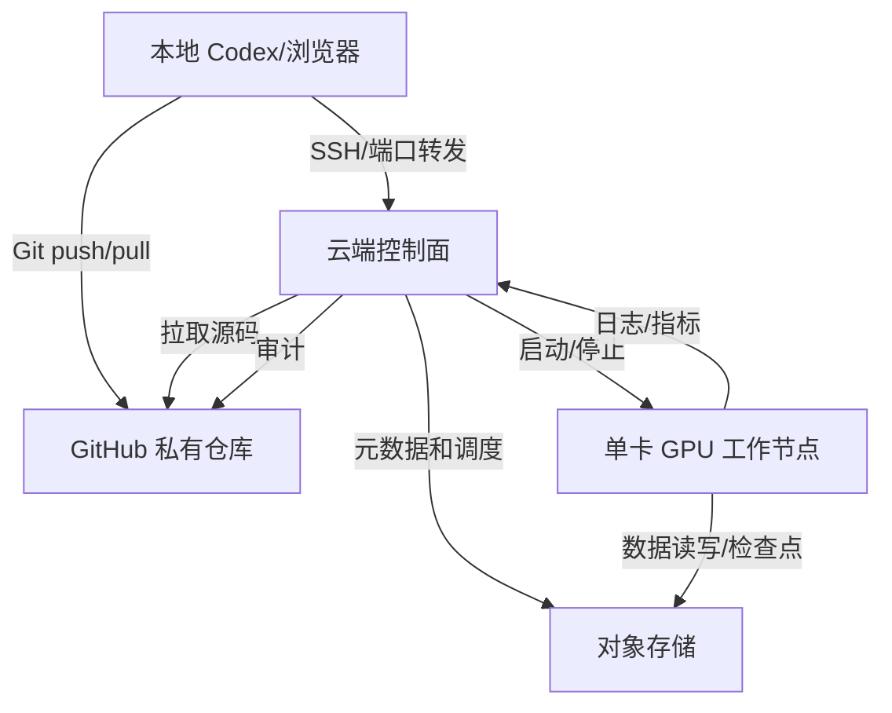

# 大肠杆菌云上最小 Demo：低成本实施方案

> 目标周期：12 个月  
> 方案定位：验证“词表 -> 频谱 -> 知识约束 -> 三维质点演化 -> 轨迹反馈”的完整技术闭环，不宣称构建高保真全细胞模型。  
> 建议预算：基础档 3,000-6,000 元/年；稳态档 6,000-10,000 元/年；不含 Codex 订阅或 API 用量。  
> 方案原则：CPU 控制面常驻、GPU 按小时启停、对象存储长期保存、所有实验可复现、Codex 全程可审计操作。

> 若要求所有基础设施都落在阿里云生态内，见  
> [`大肠杆菌云上最小Demo_全阿里云版.md`](./大肠杆菌云上最小Demo_全阿里云版.md)。

## 1. 结论

推荐采用以下最小成本组合：

| 层 | 首选 | 备选 | 选择理由 |
|---|---|---|---|
| 代码与审计 | GitHub 私有仓库 | 自建 Gitea | 免费、天然有版本历史、适合 Codex 做分支和提交 |
| 数据与模型制品 | Cloudflare R2 或阿里云 OSS/COS | S3 | 长期存储便宜，支持版本控制，便于迁移 |
| 计算实例 | AutoDL 单卡 24GB，按量/包日、用完关机 | RunPod Secure A5000/A40 | 中国区访问和付款更方便；AutoDL 成本低，RunPod 更接近标准云 |
| 控制面 | AutoDL 无卡/低配模式，或轻量云主机 2 vCPU/4 GB | 本地 Codex + SSH | 日常任务几乎不用 GPU，避免 GPU 空转 |
| 任务运行 | Docker + tmux + Python CLI | Slurm | 最小 Demo 不需要集群调度器 |
| Codex 操作 | 云端安装 Codex CLI，本地 Codex 通过 SSH 驱动 | Codex Cloud + GitHub 做代码任务 | 云端环境持有数据和 GPU；本地只做控制与评审 |
| 元数据 | SQLite/DuckDB + Git 清单 | PostgreSQL | 单机规模足够，维护成本低 |
| 实验追踪 | MLflow 本地文件后端 | Weights & Biases | 先避免 SaaS 依赖和额外费用 |

这套组合的核心是：

1. 代码在 Git 中。
2. 原始数据、清洗数据、检查点和关键输出在对象存储中。
3. GPU 实例只是可丢弃的计算器，不保存唯一副本。
4. Codex 通过 SSH、CLI、Git 和脚本操作云端，不依赖网页手工点击。
5. 每月设置硬预算和自动停机机制。

## 2. Demo 范围

### 2.1 生物学对象

选择大肠杆菌 K-12 MG1655 作为最小对象：

- 基因组约 4.64 Mb，远小于人类基因组。
- 核心代谢、转录调控和基础生理数据较完整。
- iML1515 等基因组尺度代谢模型可直接作为先验和基线。
- RegulonDB、UniProt、NCBI、BiGG、STRING 等公开资源可覆盖首批词表。

### 2.2 第一版只做一个可验证子系统

建议将第一版限定为“中心碳代谢 + lac 操纵子调控”：

| 对象 | 规模 |
|---|---:|
| 分子元件种类 | 40-80 |
| 关键反应/互作规则 | 40-100 |
| 质点 | 2,000-20,000 |
| 空间区室 | 胞外、周质、胞质 |
| 空间分辨率 | 50-100 nm |
| 逻辑时间步 | 1,000-5,000 |
| 扰动 | 葡萄糖/氧限制、lacZ 敲除、lacI 敲除、lacY 过表达 |
| 输出 | 轨迹、浓度曲线、互作矩阵、增长/代谢通量代理指标 |

第一版的成功标准不是“预测真实细胞”，而是证明下列链路可以稳定、可复现地跑通：

```text
公共数据
  -> 词表与来源追踪
  -> 互作/代谢知识图谱
  -> 图频谱初始化
  -> 三维质点与逻辑时间演化
  -> 轨迹和表型输出
  -> 与 iML1515/FBA 及公开实验趋势对照
  -> 结果与模型版本入注册表
```

### 2.3 明确不做的内容

- 不做每分子、全细胞、飞秒到小时的全尺度模拟。
- 不训练 10 亿参数以上的基础模型。
- 不一开始覆盖全部 4,000 多个基因。
- 不把 KEGG、BRENDA 等有许可限制的数据直接公开再分发。
- 不在第一版引入区块链；用 Git、DVC 元数据和模型注册表实现可追溯。

## 3. 数据和先验

### 3.1 第一批数据源

| 类别 | 建议来源 | 用途 | 许可注意 |
|---|---|---|---|
| 基因组/蛋白 | NCBI RefSeq、UniProt | 基因和蛋白标识、序列 | 公开资源，保留版本号 |
| 代谢模型 | BiGG iML1515，COBRApy 读取 SBML | 化学计量、反应边界、FBA 基线 | 保存原始 SBML 和引用 |
| 转录调控 | RegulonDB | TF-靶基因、启动子、调控方向 | 核对下载条款 |
| 互作网络 | STRING E. coli | 图先验、边权 | 核对该版本许可 |
| 结构/定位 | PDB、AlphaFold DB、UniProt | 胞质/膜等初始定位 | 记录 accession |
| 酶动力学 | BRENDA、SABIO-RK | `Km`、`kcat` 等参数 | 很多字段有商业许可限制，不直接再分发 |
| 热力学 | eQuilibrator | 反应方向和能量约束 | 保存计算参数 |
| 通路 | EcoCyc、KEGG、Reactome | 通路标签和拓扑 | 开源前逐项核对许可 |
| 实验对照 | 公开 E. coli 转录组/代谢组 | 趋势验证 | 首选可明确复用的数据 |

### 3.2 数据分层

```text
data/
  raw/           # 原始下载，只读，保存来源 URL、版本、哈希和下载日期
  interim/       # 解析后中间数据
  curated/       # 统一 ID、去重、单位、方向、置信度
  external/      # 许可受限数据，不进入公开镜像
  processed/     # 训练和仿真直接读取的数据
artifacts/
  vocab/
  graphs/
  embeddings/
  checkpoints/
  simulations/
  reports/
```

每个词表项至少包含：

```text
token_id
canonical_name
entity_type         # gene / RNA / protein / metabolite / complex
external_ids        # UniProt, NCBI, BiGG, etc.
compartment
source_refs
source_version
confidence
license_tag
created_at
```

## 4. 软件架构

### 4.1 模块



### 4.2 推荐技术栈

| 功能 | 技术 |
|---|---|
| 运行环境 | Ubuntu 22.04/24.04、Docker、Python 3.11 |
| Python 环境 | `uv` + lockfile |
| 数值计算 | NumPy、SciPy、pandas、PyArrow |
| 代谢建模 | COBRApy、SBML |
| 图算法 | NetworkX，必要时 igraph |
| 深度学习 | PyTorch；以后按需引入 PyTorch Geometric |
| 轨迹存储 | Parquet + Zarr |
| 本地分析库 | DuckDB |
| 实验追踪 | MLflow 文件后端 |
| API | FastAPI |
| 可视化 | Plotly，后期再考虑 Web UI |
| 测试 | pytest、ruff、mypy |
| 版本与数据 | Git + DVC |

### 4.3 目录建议

```text
ecoli-spectral-cell/
  AGENTS.md
  pyproject.toml
  uv.lock
  src/ecoli_demo/
    ingest/
    vocabulary/
    graph/
    spectral/
    spatial/
    simulation/
    validation/
    serving/
  configs/
    data/
    vocab/
    graph/
    spectral/
    simulation/
  jobs/
  scripts/
  tests/
  infra/
    docker/
    cloud-init/
  docs/
```

## 5. 云上拓扑

### 5.1 最小可行拓扑



控制面可以不是独立云主机。第一阶段最简单的方式是：

- 使用 AutoDL 24GB 实例。
- 编写代码和管理数据时切到无卡/低配模式。
- 训练和批量模拟时切到 GPU 模式。
- 结束后立即关机。
- 关键数据自动同步到 R2/OSS/COS。

当项目进入需要常驻 API 或多人协作的阶段，再增加一台 2 vCPU/4 GB 轻量云主机作为控制面。GPU 工作节点仍然按需启停。

### 5.2 GPU 选型

第一版优先单卡 24GB：

| 平台 | 卡型 | 用途 | 注意 |
|---|---|---|---|
| AutoDL | 3090/A5000/4090 24GB | 小模型、频谱字典、GPU 质点实验 | 价格以控制台现价为准；关注 CPU 和内存配比 |
| RunPod Secure | A5000 24GB 或 A40 48GB | 更标准、可移植的运行环境 | 官方页当前 A5000 `$0.27/h`、A40 `$0.49/h` |
| RunPod Community | A5000/A40 | 最低成本实验 | 稳定性和宿主机约束弱于 Secure |

不建议第一年长期租 80GB 卡或 8 卡节点。只有满足以下任意条件才升级：

1. 24GB 显存经混合精度和梯度检查点仍不足。
2. 单次训练超过 24 小时且瓶颈明确是 GPU。
3. 已有通过固定随机种子的基线和明确扩展收益。
4. 月度预算允许，且升级任务有单独成本评估。

## 6. Codex 云上操作设计

### 6.1 推荐模式

采用“云端 Codex CLI + 本地 Codex 控制”的双层方式：

1. 云节点安装 Git、Codex CLI、Docker、SSH 和项目依赖。
2. 本地 Codex 通过 SSH 执行远程命令、查看日志、同步文件。
3. 需要连续工作时，在云端 `tmux` 中运行 Codex CLI 或非交互任务。
4. 所有代码变化先进入 Git 分支，再运行测试和任务。
5. GPU 任务通过脚本提交，任务完成或超时后自动关机。

本地 Codex 可以执行类似下面的工作流：

```bash
ssh ecoli-node "cd ~/ecoli-spectral-cell && git pull --ff-only"
ssh ecoli-node "cd ~/ecoli-spectral-cell && uv run pytest -q"
ssh ecoli-node "cd ~/ecoli-spectral-cell && tmux new -d -s train 'bash scripts/run_gpu_job.sh configs/simulation/mvp.yaml'"
ssh ecoli-node "tail -n 100 ~/ecoli-spectral-cell/artifacts/runs/latest.log"
```

当 Codex CLI 安装在云节点后，可以在云端直接执行：

```bash
tmux new -As codex
cd ~/ecoli-spectral-cell
codex
```

Codex Cloud 更适合绑定 GitHub 仓库做代码生成、评审和容器内测试。不要把它当作长期保存 E. coli 数据和持久 GPU 训练结果的唯一环境。长期数据和 GPU 任务仍由云主机、对象存储和 Git 承担。

### 6.2 权限边界

建议建立三个独立身份：

| 身份 | 权限 |
|---|---|
| `codex-dev` | 项目目录读写、运行测试和任务，不能修改云账号和安全组 |
| `workload` | 只读写指定数据桶和实验目录 |
| `infra-admin` | 创建/销毁实例、管理网络和密钥；仅用于基础设施操作 |

日常 Codex 工作使用 `codex-dev`，不向它暴露云账号主密钥。云端密钥使用 SOPS+age、云 Secret Manager 或部署平台的 secrets，不写入 Git。

### 6.3 `AGENTS.md` 必须写明的规则

```text
- 不删除 data/raw、对象存储版本和已有 artifacts。
- 任何 GPU 任务必须设置最大运行时间和自动关机。
- 训练前记录 Git commit、数据版本、容器镜像 digest。
- 不使用 KEGG/BRENDA 等受限数据生成公开可下载镜像。
- 不把密钥、Signed URL、云账号信息写入日志或提交。
- 单次超过 2 GPU 小时的任务必须先估算成本和产出。
- 所有科学结论必须附基线、验证集和失败案例。
```

## 7. 一年实施路线

### 第 1 个月：云环境和最小数据闭环

- 开通 AutoDL 或 RunPod，创建 24GB GPU 实例和持久化存储。
- 建立 GitHub 私有仓库、R2/OSS/COS 数据桶和 DVC。
- 安装 Docker、Codex CLI、uv、COBRApy 和 PyTorch。
- 下载 NCBI/UniProt/iML1515/RegulonDB，记录版本和哈希。
- 完成 40-80 个 token 的第一版词表。

交付物：可一键重建的开发环境、数据清单、来源追踪表、成本告警。

### 第 2-3 个月：图谱和三维引擎

- 从 iML1515 生成代谢图和 FBA 基线。
- 从 RegulonDB 生成小规模调控图。
- 完成图傅里叶初始化和简单频谱签名。
- 实现三区室、2,000-20,000 质点、布朗运动和 40-100 条概率规则。
- 以逻辑时间运行 1,000-5,000 步并保存 Parquet/Zarr 轨迹。

交付物：词表 -> 图谱 -> 频谱 -> 三维轨迹的最小闭环。

### 第 4-6 个月：单卡训练和 E. coli 扰动场景

- 在单张 24GB GPU 上训练小型频谱字典/状态预测模型。
- 实现葡萄糖、氧、lacZ/lacI/lacY 扰动。
- 与 iML1515/FBA 和公开实验趋势对照。
- 建立固定随机种子、消融实验和失败案例。

交付物：可复现的单卡实验矩阵和第一版验证报告。

### 第 7-9 个月：验证和稳定性

- 增加中心碳代谢的关键动力学约束。
- 评估数据遗漏、因果方向错误、守恒量违反和外推失败。
- 将模型和模拟器 API 化，但不把 Jupyter 暴露到公网。
- 每季度做一次从对象存储和 Git 完整恢复演练。

交付物：可交互 Demo、验证指标、恢复演练记录。

### 第 10-12 个月：打包和复用

- 固化 Docker 镜像、数据版本和模型版本。
- 输出 10-20 分钟可重复运行的 Demo。
- 形成“新物种/新菌株适配清单”。
- 复盘 GPU 小时、存储增长和每类实验的单位成本。

交付物：可迁移的最小系统，而不是绑定单一云厂商的临时脚本。

## 8. 成本测算

价格会随地区和活动变化，必须以购买时控制台和官方价格页为准。下面只用于预算控制。

### 8.1 方案 A：AutoDL 为主，适合中国区最低成本

假设每月 60-120 GPU 小时，单卡 24GB 平均 2-3 元/小时：

| 项目 | 月度估算 | 年度估算 |
|---|---:|---:|
| GPU 60-120 小时 | 120-360 元 | 1,440-4,320 元 |
| 无卡/低配操作 50-100 小时 | 5-20 元 | 60-240 元 |
| 持久化和备份 100-300 GB | 30-100 元 | 360-1,200 元 |
| 快照、流量和杂项 | 20-50 元 | 240-600 元 |
| **合计** | **约 175-530 元** | **约 2,100-6,360 元** |

建议以此为主方案，年度总预算预留 8,000-12,000 元的人员调试和超额缓冲。

### 8.2 方案 B：RunPod Secure + 轻量控制机

以官方页当前公布的 A5000 Secure `$0.27/h`、A40 Secure `$0.49/h` 和标准网络存储 `$0.07/GB/月` 估算：

| 项目 | 月度估算 | 年度估算 |
|---|---:|---:|
| GPU 60-120 小时 | `$16-$59` | `$192-$708` |
| 200 GB 持久存储 | `$14` | `$168` |
| 2 vCPU/4 GB 控制机 | `$10-$20` | `$120-$240` |
| 备份、流量和杂项 | `$5-$15` | `$60-$180` |
| **合计** | **约 `$45-$108`** | **约 `$540-$1,296`** |

该方案年费用约 4,000-9,500 元，稳定性和可移植性更好。

### 8.3 明确避免的方案

- 长期租一张 A40 常开：仅 GPU 就约 `$0.49 x 730 = $358/月`，远高于按需使用。
- 一开始就使用 8 卡节点：第一年没有必要，且调试、数据加载和成本风险都很高。
- 把唯一数据放在实例系统盘：实例迁移、欠费或硬件故障时不可恢复。
- 把 Jupyter、MLflow、SSH 全部暴露到公网：会产生安全和扫描流量成本。

## 9. 预算护栏

建议设置以下硬限制：

| 项目 | 默认限制 |
|---|---:|
| 单卡 GPU | 1 张，24GB 优先 |
| GPU 自动运行 | 最长 6 小时，超时自动停止 |
| 空闲关机 | 15-30 分钟无任务即关机 |
| 月 GPU 小时 | 基线 80 小时，硬上限 150 小时 |
| 月总预算 | 500-800 元，达到 80% 告警 |
| 对象存储 | 基线 200 GB，超过 300 GB 必须复盘 |
| 原始轨迹保留 | 90 天，关键批次永久保留 |
| 多 GPU 任务 | 必须单独审批 |

在云端加入每日成本检查：

```text
每小时记录：实例状态、GPU 使用率、运行任务、已消费金额。
每天检查：是否有空闲实例、异常流量、孤儿磁盘、未完成同步。
每周检查：存储增长、失败任务浪费的 GPU 小时。
每月检查：单位实验成本、下一月预算、是否释放不再需要的数据副本。
```

## 10. 安全与恢复

### 10.1 最小安全基线

- SSH 仅允许密钥登录，禁用密码、root 直登和公网数据库端口。
- 使用 Tailscale/WireGuard 或 SSH 跳板访问 Web UI。
- 控制台启用 MFA。
- 数据和模型桶启用版本控制、生命周期和禁止公开访问。
- 日志中自动遮蔽 token、cookie、Signed URL 和密钥。
- 生成式 API 密钥、云账号密钥和训练任务使用不同凭据。

### 10.2 恢复目标

- Git 仓库丢失某分支：可从远端恢复。
- 实例丢失：30-60 分钟内在同地区重建开发环境。
- 对象存储误删：从版本控制或 30 天备份恢复。
- 数据桶本身不可用：R2/OSS/COS 之间保留可迁移副本。
- 供应商停止服务：Docker 镜像和 DVC 清单可在 RunPod/Aliyun/本地重新运行。

## 11. 验收标准

第 12 个月结束时，至少满足：

1. 一条命令完成环境重建，一条命令运行最小 Demo。
2. 词表中每个 token 都可追溯到来源版本和许可标签。
3. 图谱、频谱、三维模拟器都有单元测试和固定小样本基线。
4. 至少完成 3 组扰动，与 FBA 和公开实验趋势进行对照。
5. 所有结果附 Git commit、数据版本、容器摘要和运行参数。
6. 单次 Demo 可在 30-120 分钟、单张 24GB GPU 或合理 CPU 资源内完成。
7. 从对象存储和 Git 完成一次全量恢复演练。
8. 年成本控制在设定上限内，能够说明每一小时 GPU 的产出。

## 12. 推荐立即执行的下一步

1. 选择主平台：中国区成本优先选 AutoDL，稳定性优先选 RunPod Secure。
2. 只开通一个 24GB GPU 实例，不租集群。
3. 建立 GitHub 私有仓库、R2/OSS/COS 桶和独立实验目录。
4. 安装 Codex CLI，写入 `AGENTS.md` 和成本护栏。
5. 先做 40-80 token 的中心碳代谢 Demo，不碰全基因组。
6. 第一周只跑 CPU 数据流水线，确认数据、许可和复现性。
7. 第二周才启动第一次 GPU 训练，并记录单位成本和基线。

## 13. 参考

- AutoDL 计费与存储规则：<https://www.autodl.com/docs/price/>
- AutoDL GPU 选型：<https://www.autodl.com/docs/gpu/>
- RunPod 当前 GPU、网络存储价格：<https://www.runpod.io/pricing>
- 阿里云按量付费说明：<https://www.alibabacloud.com/help/en/ecs/pay-as-you-go>
- Codex 官方云端说明入口：<https://developers.openai.com/codex/cloud>

OpenAI 官方文档在当前网络环境下返回 403，因此本方案不对 Codex Cloud 的具体区域、配额或账号权限作保证。云上操作路径以实际可用的云端 Codex CLI、SSH、Git 和任务脚本为准。
