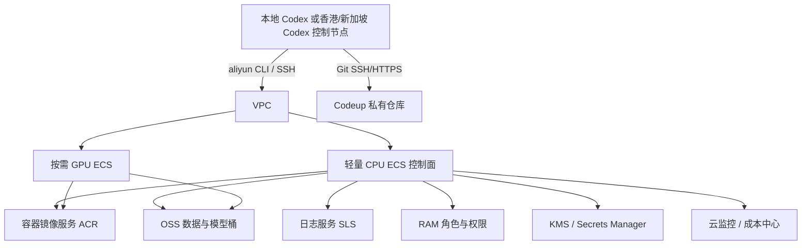

# 大肠杆菌云上最小 Demo：全阿里云版

> 周期：12 个月  
> 范围：使用大肠杆菌 K-12 验证频谱词表、知识图谱、三维质点和轨迹反馈的最小闭环。  
> 结论：基础设施可以完全放在阿里云生态内；Codex 本体仍然属于 OpenAI，不能被阿里云产品替代。Codex 可以运行在本地或阿里云 ECS 上，再通过 SSH、`aliyun` CLI、Git 和 OSS 操作整套环境。  
> 预算建议：精简档约 3,000-8,000 元/年；稳态档约 8,000-18,000 元/年；不含 Codex 费用。若长期租 A10 包月实例，GPU 单独可能接近 1.5 万元/年以上，因此不推荐长期开机。

> 本方案采用“本地 Codex 控制 + 阿里云基础设施和算力”作为默认落地模式。该模式可行，且比在阿里云上再部署一套 Codex 更简单、网络风险更低。阿里云只负责运行、存储和调度实际负载，Codex 在本地通过阿里云 API、SSH 和 OSS 工具操作。

> 成本提醒：阿里云 `gn7i` A10 24GB 首月按量试跑报价可能接近 `￥9.74/小时`。如果目标是先验证工作流而不是购买企业级云治理能力，建议先使用  
> [`首月GPU云_低成本替代选择.md`](./首月GPU云_低成本替代选择.md) 中的 AutoDL 或 RunPod 方案，确认工作量和性能后再迁回阿里云。

## 1. 先回答“能否完全依靠阿里云”

可以，但有三个边界：

1. **计算、存储、镜像、密钥、日志、代码仓库和监控**都可以完全使用阿里云。
2. **Codex 本身不是阿里云服务**。可以把 Codex CLI 安装在阿里云 ECS 上，也可以只在本地运行 Codex，再让它操作阿里云。
3. 如果 Codex 运行在中国大陆 ECS 上，需要实际验证其访问 OpenAI、GitHub、公共生物数据库的网络稳定性。若网络受限，推荐使用“本地 Codex 控制 + 阿里云负载”或把 Codex 控制节点放在阿里云香港/新加坡地域。

因此，最稳妥的“全阿里云”定义是：

```text
阿里云承载全部项目基础设施和数据
Codex 作为控制/开发代理，通过标准协议操作阿里云
```

而不是要求 Codex 模型本身由阿里云提供。

### 1.1 本方案采用的目标形态

```text
本地 Codex
  -> 阿里云 CLI/API：创建、启动、停止、查询资源
  -> SSH 或 Cloud Assistant：在云节点执行命令和任务
  -> Codeup：同步代码和实验配置
  -> OSS：传输数据和模型制品

阿里云
  -> CPU ECS：控制面、Git、调度、日志
  -> GPU ECS：训练和批量模拟
  -> OSS/ACR/RAM/KMS/SLS：数据和平台服务
```

本地机器不承担训练，也不通过本地网络搬运大规模数据。Codex 发出的只是控制命令和小型配置，数据切片、checkpoint 和轨迹都在阿里云内网或 OSS 与计算节点之间传输。

该模式的可行性依赖四个条件：

| 条件 | 要求 |
|---|---|
| 本地到阿里云控制面 | 能访问 Alibaba Cloud API 和 ECS SSH 端口 |
| 身份认证 | 使用受限 RAM 用户/角色和独立 Codex 配置 profile |
| 远程执行 | 优先使用 SSH；无公网 GPU 节点使用 Cloud Assistant 或控制节点跳转 |
| 任务脱离本地 | 实际任务在 `tmux`、systemd 或云端调度器中运行，本地 Codex 掉线不影响任务 |

## 2. 推荐的全阿里云架构



### 2.1 不采用的重型组件

第一年不建议使用：

- ACK/Kubernetes：单机任务不需要，节点池和集群维护会增加成本。
- E-HPC：只适合大规模并行，不适合当前 2,000-20,000 质点的 MVP。
- NAS 通用型文件系统：单 GPU 时 OSS + ESSD 更便宜，NAS 留到多机并行阶段。
- 长期包月 GPU：只有月使用超过约 250-300 GPU 小时才可能比按量/抢占式划算。
- 公网 JupyterLab：安全风险高，改为 SSH 端口转发。

PAI-DSW/PAI-DLC 可以作为后续托管训练选项，但不作为第一版核心，因为它会隐藏部分调度和成本细节，也让 Codex 的 SSH/脚本工作流更复杂。

## 3. 阿里云产品映射

| 功能 | 阿里云产品 | 第一版用法 |
|---|---|---|
| 代码仓库 | Codeup | 私有仓库、分支、MR、Git SSH |
| 控制面 | ECS 通用型 2 vCPU/4 GiB | Docker、Codex CLI、调度脚本、FastAPI |
| GPU 工作节点 | ECS `gn7i` A10 24GB | 训练、频谱模型、批量 GPU 实验 |
| 低成本 GPU | ECS `gn6i` T4 16GB | 最小 Demo、调试、早期验证 |
| 弹性 GPU | 抢占式 ECS 或按量 GPU ECS | 可中断训练，必须频繁 checkpoint |
| 对象存储 | OSS | 原始数据、清洗数据、检查点、报告 |
| 块存储 | ESSD PL0/PL1 | 本地临时数据、Docker 层、活动工作区 |
| 镜像仓库 | ACR | 固化 Python/CUDA/项目镜像 |
| 密钥 | KMS + Secrets Manager | API key、数据库口令、Signed URL 密钥 |
| 权限 | RAM + STS | Codex 使用受限角色，不持有账号主密钥 |
| 日志 | SLS | 训练日志、审计日志、成本与任务记录 |
| 监控 | 云监控 CloudMonitor | GPU 利用率、空闲告警、自动停机 |
| 审计 | ActionTrail | 记录启停实例、修改安全组等敏感操作 |
| 网络 | VPC + vSwitch + 安全组 + EIP | 私网通信，SSH 仅从控制节点进入 |
| 成本 | 费用中心 + 预算 | 月度硬预算与异常消费告警 |
| 自动化 | Function Compute + OOS | 空闲停机、快照、桶巡检和成本日报 |

## 4. 计算实例选择

### 4.1 推荐实例

| 场景 | 实例族 | GPU | 说明 |
|---|---|---|---|
| CPU 控制面 | `ecs.g7`/`ecs.c7` 2 vCPU/4 GiB | 无 | 长期在线，执行 Codex、Git、调度和 API |
| 最小 GPU 验证 | `gn6i` | T4 16GB | 便宜、够跑小模型和 2,000-20,000 质点 |
| 主力训练 | `gn7i` | A10 24GB | 首选的 24GB 单卡，支持 FP16 和主流 PyTorch |
| 后续大模型 | `gn8is` 或更新 L20 | L20 48GB | 仅当 24GB 明确不足时启用 |
| 大规模训练 | `gn7e` 或更高级 | A100 级 | 第一年不建议 |

对于当前 E. coli MVP，`gn6i` 16GB 可承担大部分调试，`gn7i` 24GB 用于正式训练和消融实验。不要因为 48GB/80GB 卡“更省心”而让固定成本上升。

### 4.1.1 首月试用采购单

首月目标是验证工作流，不是追求最大性能。建议只购买一台按量付费 GPU ECS，不购买包年包月实例，也暂不单独购买 CPU 控制面 ECS。

推荐配置：

| 配置项 | 首选 | 低成本备选 |
|---|---|---|
| 地域 | 华东 1（杭州）或华东 2（上海） | 华北 2（北京） |
| 实例规格 | `ecs.gn7i-c8g1.2xlarge` | `ecs.gn6i-c4g1.xlarge` |
| CPU/内存 | 8 vCPU / 30 GiB | 4 vCPU / 15 GiB |
| GPU | 1 x NVIDIA A10 24GB | 1 x NVIDIA T4 16GB |
| 计费方式 | 按量付费 | 按量付费 |
| 停止模式 | 节省停机模式 | 节省停机模式 |
| 镜像 | Ubuntu 22.04/24.04 LTS，带 GPU 驱动 | 相同 |
| 系统盘 | 100-200 GB ESSD PL1 | 100 GB ESSD PL1 |
| 数据盘 | 首月可不买 | 首月可不买 |
| 网络 | EIP，按流量计费，10 Mbps 峰值 | 相同 |
| 安全组 | SSH 仅允许本地公网 IP | 相同 |
| 自动释放 | 设置为试用开始后 31 天 | 相同 |

选择原则：

1. A10 24GB 是首选，兼容性和显存余量都比 T4 更安全，适合首个完整工作流。
2. 如果只是希望最低成本地跑通数据、Docker、CUDA 和小模型链路，T4 16GB 足够；正式训练前可释放并换成 A10。
3. 首月使用按量付费，不使用抢占式。抢占式适合已经支持 checkpoint 的正式任务，不适合第一次验证新环境。
4. 先用 EIP 按流量计费，流量峰值限制在 10 Mbps。OSS 使用同地域内网 endpoint，避免大文件走公网。
5. 系统盘不要超过 200 GB。数据、镜像层和 checkpoint 的长期副本应放在 OSS/ACR，而不是继续扩大云盘。
6. 配置自动释放时间，防止试用结束后实例持续计费。

首月建议只运行 60-100 GPU 小时：

| 阶段 | GPU 使用 |
|---|---:|
| 安装、CUDA、Docker、OSS 和 SSH 验证 | 2-5 小时 |
| iML1515/FBA 与词表 CPU 流程 | 0 小时，可在同一 ECS 上执行 |
| 小型频谱模型和 GPU 质点实验 | 20-40 小时 |
| 扰动实验、checkpoint 恢复和容器恢复演练 | 30-50 小时 |
| 预留调试时间 | 10-20 小时 |

首月必须完成以下验收：

- 本地 Codex 可以通过 SSH 启停、登录和操作 ECS。
- `nvidia-smi`、Docker GPU 透传和 `torch.cuda.is_available()` 正常。
- Codeup、ACR 和 OSS 的读写链路正常。
- iML1515/FBA 基线可以在 CPU 上运行。
- 一个 2,000-20,000 质点的小型任务可以在 GPU 上运行。
- 训练任务写入 checkpoint 后，可以停止实例、重新启动并从 checkpoint 继续。
- 不依赖本地终端保持在线，任务可以在远程 `tmux` 中继续。
- 查看账单后能够计算每 GPU 小时的成本，并确认空闲停机有效。

一个月试用结束后再决定：

- 如果 A10 显存和速度有明确余量，下一阶段改为抢占式以降低成本。
- 如果 T4 已足够，继续使用 T4，不为未来需求提前付费。
- 如果需要长期在线控制面，再增加一台 2 vCPU/4 GiB CPU ECS。
- 如果月 GPU 使用长期超过 250-300 小时，再评估短期包月。

### 4.2 停止和计费

阿里云 ECS 的停机规则必须区分：

| 付费模式 | 停机行为 |
|---|---|
| 包年包月 | 停机仍继续计费 |
| 按量付费，标准停机 | 计算资源继续计费，直到释放 |
| 按量付费，节省停机模式 | vCPU、内存、镜像和按带宽公网 IP 停止计费；云盘继续计费 |
| 抢占式实例 | 可能因库存或出价被回收 |

节省停机模式存在两个风险：

1. 重新开机时可能因库存不足失败。
2. 静态公网 IP 释放后，下次启动 IP 可能改变。

因此 GPU 节点必须设计成可丢弃节点：

- 系统盘只保存环境和临时文件。
- 代码来自 Codeup。
- 数据来自 OSS。
- 镜像来自 ACR。
- checkpoint 每 10-20 分钟写 OSS。
- 自动停机后即使换实例或换可用区，也能在 30-60 分钟内恢复。

### 4.3 抢占式和按量选择

| 任务 | 建议模式 |
|---|---|
| 调试、短实验 | 按量 + 节省停机 |
| 可恢复训练 | 抢占式，最高出价设置上限 |
| 长训练、正式消融 | 按量，必要时短周期包月 |
| 仅运行几十分钟的数据任务 | CPU ECS，不使用 GPU |

抢占式实例适合可中断任务，不适合唯一保存训练状态的实例。所有任务必须支持从 checkpoint 续跑。

## 5. 存储设计

### 5.1 OSS 桶

建议至少建立四个桶或四个顶层前缀：

```text
ecoli-raw/           # 原始下载和许可证记录，开启版本控制
ecoli-work/          # interim、curated、processed
ecoli-artifacts/     # 频谱字典、checkpoint、三维轨迹
ecoli-reports/       # 验证报告、图表、发布包
```

存储类型：

- 活动数据使用 OSS Standard。
- 30 天以上、偶尔访问的数据转 IA。
- 60-180 天以上、仅审计需要的数据转 Archive。
- 不直接把正在训练使用的数据放 Archive。

OSS 开启：

- 版本控制。
- 禁止公共访问。
- 生命周期规则。
- 服务端加密。
- 跨区域复制可选，重点数据才启用。
- ECS 使用同地域内网 endpoint，降低流量费用和延迟。

### 5.2 ESSD

控制面使用 40-100 GB ESSD，GPU 节点使用 200-500 GB ESSD 或本地临时盘：

```text
/workspace        # Git 工作区
/scratch          # 仅本机使用的缓存和临时轨迹
/mnt/oss          # ossfs 或 rclone，用于小文件和 checkpoint
/data             # 任务启动时从 OSS 拉取的数据切片
```

不要把成千上万的小文件逐个频繁读写 OSS。训练前打包成 Parquet/Zarr/TAR，启动时批量拉取，训练结束再批量上传。

## 6. 代码、镜像和密钥

### 6.1 Codeup

将 Codex 工作流约束为：

```text
main          # 只接受通过测试和评审的变更
codex/*       # Codex 自动分支
experiment/*  # 实验配置和结果索引，不提交大数据
```

`AGENTS.md` 中明确：

- 不允许直接向 `main` 强推。
- 不提交 `.env`、AccessKey、Signed URL、私有数据。
- 不删除 OSS 版本和 `data/raw`。
- GPU 任务必须带最大时长和成本标签。
- 每个实验必须记录 Codeup commit、镜像 digest 和数据版本。

### 6.2 ACR

建立两个镜像：

```text
ecoli-base:python311-cu12
ecoli-demo:<git-sha>
```

镜像 tag 必须包含 Git SHA，禁止只用 `latest` 运行正式实验。ACR 个人版可以起步；当需要 VPC 内网访问控制、跨地域同步或团队权限时再升级企业版。

### 6.3 RAM 和 KMS

建立三个 RAM 身份：

| 身份 | 权限 |
|---|---|
| `codex-dev` | Codeup、指定 OSS 前缀、SLS 读取、受控 ECS 启停 |
| `gpu-workload` | 只访问指定 OSS 桶、ACR 拉取和 SLS 写入 |
| `infra-admin` | 创建/删除 ECS、网络、快照和预算规则 |

不要让 ECS 实例保存长期 AccessKey。优先使用 RAM 角色和 STS 临时凭证。Codex 日常开发使用 `codex-dev`，创建或释放云资源时由单独流程使用 `infra-admin`。

## 7. Codex 如何操作阿里云

### 7.1 正式推荐：本地 Codex 控制

这是中国大陆网络环境下最稳妥的方式：

```text
本地 Codex
  -> aliyun CLI 启停 ECS、查询费用、操作 OSS
  -> SSH 到 CPU 控制节点
  -> 在控制节点执行 Git、Docker 和实验任务
```

Codex 可以执行的典型操作：

```bash
aliyun ecs DescribeInstances --RegionId cn-shanghai
aliyun ecs StartInstance --InstanceId i-xxxxxxxx
aliyun ecs StopInstance --InstanceId i-xxxxxxxx --StoppedMode StopCharging
aliyun oss ls oss://ecoli-artifacts/
ossutil cp -r ./configs oss://ecoli-work/configs/
ssh ecoli-control "cd ~/ecoli-demo && git pull --ff-only"
ssh ecoli-control "docker run --rm ecoli-demo:<sha> pytest -q"
```

这种方式下，阿里云承载全部基础设施，Codex 只在本地控制，不依赖大陆 ECS 访问 OpenAI。

#### 7.1.1 通过 WSL 操作阿里云 ECS

可以沿用本地 Linux 虚拟机的操作方式，但远程 ECS 不是本地 WSL 发行版，而是通过网络连接的 Linux 主机。控制链如下：

```text
本地 Codex
  -> wsl.exe
  -> WSL2 Ubuntu
  -> ssh / aliyun CLI / ossutil
  -> 阿里云控制面 ECS 或 GPU ECS
```

在 WSL 中安装：

```bash
sudo apt update
sudo apt install -y openssh-client git rsync tmux curl unzip
```

建议将 SSH 私钥只保存在 WSL 的 `~/.ssh/` 中：

```bash
ssh-keygen -t ed25519 -f ~/.ssh/ecoli_ed25519 -C "codex-aliyun-ecoli"
```

然后在 WSL 的 `~/.ssh/config` 中配置：

```sshconfig
Host ecoli-control
    HostName <控制面 ECS 公网 IP>
    User ecs-user
    IdentityFile ~/.ssh/ecoli_ed25519
    ServerAliveInterval 30
    ServerAliveCountMax 6
    ControlMaster auto
    ControlPath ~/.ssh/cm-%r@%h:%p
    ControlPersist 10m

Host ecoli-gpu
    HostName <GPU ECS 私网 IP>
    User ecs-user
    IdentityFile ~/.ssh/ecoli_ed25519
    ProxyJump ecoli-control
    ServerAliveInterval 30
```

本地 Codex 可以通过 PowerShell 或 WSL 环境执行：

```powershell
wsl.exe -d Ubuntu -- ssh ecoli-control "uname -a"
wsl.exe -d Ubuntu -- ssh ecoli-control "cd ~/ecoli-demo && git pull --ff-only"
wsl.exe -d Ubuntu -- ssh ecoli-control "tmux new -d -s train 'bash scripts/run_gpu_job.sh'"
wsl.exe -d Ubuntu -- rsync -av ./configs/ ecoli-control:~/ecoli-demo/configs/
```

WSL 方案需要注意：

1. 当前会话未检测到已安装的 WSL 发行版，需先安装 WSL2 Ubuntu。
2. 控制面 ECS 的安全组只允许当前出口 IP 访问 SSH；IP 变化时通过受限 RAM 身份更新规则。
3. GPU ECS 不直接暴露 SSH，使用控制面 `ProxyJump` 或 Cloud Assistant。
4. 训练任务必须运行在远程 `tmux`、systemd 或调度器中，不能依赖 WSL 终端保持在线。
5. WSL 只传代码、配置和命令，大规模数据使用 OSS，不通过本地 Windows 中转。

如果当前 Windows OpenSSH 已可访问 ECS，也可以直接执行 `ssh ecoli-control ...`，即使没有安装 WSL 也不影响本地 Codex 控制阿里云。

### 7.2 可选模式：云端 Codex 控制节点

如果必须让 Codex 完全运行在云端：

1. 在阿里云香港或新加坡创建 2 vCPU/4 GiB ECS。
2. 在同一地域或通过内网连接部署控制面。
3. 在大陆地域运行 GPU 工作负载。
4. 使用 Codeup、OSS 跨地域复制或公网加密同步传递非敏感制品。

这个模式仍属于阿里云生态，但跨地域数据同步和网络延迟会增加复杂度。

本方案不要求把 Codex 部署到云端。只有在本地机器经常不可用、多人需要稳定的云端工作区，或必须让 Codex 在云端无人值守执行时，才考虑该模式。

### 7.3 云端任务执行

控制节点安装：

```text
git
docker
aliyun CLI
ossutil
tmux
uv
codex CLI
```

GPU 任务示例：

```bash
docker run --rm --gpus all \
  -v /scratch:/scratch \
  -e OSS_BUCKET=ecoli-artifacts \
  registry.cn-shanghai.aliyuncs.com/team/ecoli-demo:<sha> \
  python -m ecoli_demo.train --config configs/spectral/mvp.yaml
```

任务脚本负责：

1. 从 OSS 拉取最小数据切片。
2. 写入任务开始时间和预算标签。
3. 每 10-20 分钟上传 checkpoint。
4. 记录 SLS 日志和 MLflow 指标。
5. 无论成功失败都上传最后的指标和错误。
6. 发出 `aliyun ecs StopInstance` 或交给自动停机策略。

## 8. 自动停机与成本护栏

### 8.1 必做护栏

| 项目 | 规则 |
|---|---:|
| GPU 实例数 | 默认 1 |
| 单次任务上限 | 6 小时 |
| 空闲判定 | GPU 利用率低于 5% 持续 20 分钟 |
| 月度 GPU 时长 | 基线 80 小时，硬上限 150 小时 |
| 月度总预算 | 800-1,500 元，80% 告警 |
| OSS 活动数据 | 200-300 GB |
| 快照保留 | 7-30 天，关键版本单独保留 |
| 公网访问 | 仅 SSH 控制节点，禁止 Jupyter/数据库公网暴露 |

### 8.2 自动化

在云监控中为 GPU ECS 建立：

- CPU、GPU、内存、网络和磁盘使用率告警。
- 运行时间超过 6 小时告警。
- 无任务但仍在运行告警。
- 月度消费达到预算 50%、80%、100% 告警。

使用 OOS 或 Function Compute 执行：

- 每天列出运行中的 GPU ECS。
- 检查是否有任务心跳。
- 空闲实例自动停止。
- 每周输出 GPU 小时、OSS 容量和失败任务浪费。
- 每月生成成本报告。

## 9. 成本判断

阿里云 GPU 的单价通常高于 AutoDL/RunPod 等 GPU 专用平台，主要成本来自：

1. GPU ECS 本身。
2. 系统盘和数据盘持续计费。
3. 节省停机时的公网 IP、EIP、快照和 OSS。
4. 跨地域流量和公网下载。
5. 控制面、ACR、SLS 等基础服务。

### 9.1 精简档

适合 CPU 数据工程和 T4 小规模实验：

| 项目 | 估算 |
|---|---:|
| 2 vCPU/4 GiB 控制 ECS | 80-200 元/月 |
| T4 16GB 抢占式/按量 30-60 小时 | 100-300 元/月 |
| OSS 100-200 GB、SLS、快照 | 30-100 元/月 |
| EIP、流量和杂项 | 20-80 元/月 |
| **合计** | **约 230-680 元/月** |
| **年度** | **约 2,800-8,200 元** |

### 9.2 稳态档

适合 A10 24GB 正式训练，每月 60-120 GPU 小时：

| 项目 | 估算 |
|---|---:|
| 2 vCPU/4 GiB 控制 ECS | 80-200 元/月 |
| A10 24GB 按量/抢占式 60-120 小时 | 350-1,000 元/月 |
| OSS 200-500 GB、ACR、SLS、快照 | 60-200 元/月 |
| EIP、流量和杂项 | 50-150 元/月 |
| **合计** | **约 540-1,550 元/月** |
| **年度** | **约 6,500-18,600 元** |

以上是预算边界，不是阿里云官方报价。实例规格、地域、库存、折扣和当前活动会造成明显差异，正式购买前必须使用对应地域的 ECS 价格计算器。

### 9.3 包月实例的判断

阿里云公开产品页当前列出的 A10 24GB 单卡方案有接近 `$221.3/月` 起的示例。按此量级，一年仅 GPU 就可能超过 1.5 万元。只有当每月 GPU 使用超过约 250-300 小时，或者需要长期独占和稳定库存时，包月才值得考虑。

对当前 Demo，优先顺序是：

1. 抢占式 A10/A5000 级实例。
2. 按量 A10 + 节省停机。
3. 短期包月，只在密集训练阶段使用。
4. 长期包月，最后考虑。

## 10. 推荐部署顺序

### 第 1 步：账户和区域

- 选择距用户较近的大陆地域，例如上海、北京或杭州。
- 如需云端运行 Codex，另外评估香港或新加坡地域。
- 创建独立资源组 `ecoli-demo`，不要和现有生产资源混用。

### 第 2 步：基础网络

- 一个 VPC、两个 vSwitch、两个可用区。
- 安全组只开放受控 SSH 来源。
- CPU 控制节点和 GPU 节点在同一 VPC。
- GPU 节点通过内网访问 OSS 和 ACR。

### 第 3 步：数据和代码

- 创建 OSS 桶、版本控制和生命周期。
- 创建 Codeup 私有仓库和 `AGENTS.md`。
- 创建 RAM 角色和最小权限策略。
- 创建 KMS 密钥和 Secrets Manager 条目。

### 第 4 步：控制面

- 创建 2 vCPU/4 GiB CPU ECS。
- 安装 Docker、Git、Codex CLI、`aliyun` CLI、`ossutil`、`uv` 和 tmux。
- 通过本地 Codex 或 SSH 完成初始化。

### 第 5 步：GPU

- 先用按量 `gn6i` T4 16GB 跑通训练镜像和 GPU 测试。
- 再用按量或抢占式 `gn7i` A10 24GB 运行正式实验。
- 任务完成立即停止或释放，不保留长期空闲 GPU。

### 第 6 步：自动化和审计

- 建立 SLS 日志、云监控告警和费用预算。
- 建立 OOS 空闲停机流程。
- 建立每季度 OSS + Git 全量恢复演练。

## 11. 全阿里云方案的主要风险

| 风险 | 影响 | 缓解 |
|---|---|---|
| GPU 库存不足 | 节省停机后无法立即开机 | 多可用区、镜像化、可迁移到其他实例族 |
| 抢占式实例被回收 | 长任务中断 | 频繁 checkpoint，任务可续跑 |
| 大陆 ECS 访问 OpenAI 不稳定 | 云端 Codex CLI 不可用 | 本地 Codex 控制，或 Codex 节点放香港/新加坡 |
| 阿里云 GPU 单价高于专营 GPU 云 | 年度成本升高 | 只在训练时启动，优先抢占式和 T4 |
| OSS 小文件频繁访问 | 延迟和请求费用上升 | 打包 Parquet/Zarr/TAR，批量同步 |
| 权限过大 | 误删资源或数据泄露 | RAM 最小权限、STS、ActionTrail、桶版本控制 |
| 云端实例成为唯一真源 | 实例丢失后无法恢复 | Codeup + OSS + ACR + IaC |

## 12. 最终建议

如果“完全阿里云”是硬要求，建议采用：

```text
本地 Codex 控制
+ 阿里云 CPU ECS 控制节点
+ 阿里云 T4/A10 按需或抢占式 GPU
+ OSS 唯一数据真源
+ Codeup 私有 Git
+ ACR 固化镜像
+ RAM/KMS/SLS/云监控/预算
```

这套方案完全可以承载一年期的 E. coli 最小 Demo。相比 AutoDL + RunPod，阿里云全栈的治理、权限、日志、审计和长期稳定性更好，但 GPU 成本通常更高。按精简档准备 3,000-8,000 元/年，按 A10 稳态档准备 8,000-18,000 元/年，并把 1,500 元/月作为普通月份的上限。

## 13. 官方参考

- ECS 实例族：<https://www.alibabacloud.com/help/en/ecs/user-guide/overview-of-instance-families>
- ECS 停机计费与节省停机：<https://www.alibabacloud.com/help/en/ecs/user-guide/stop-an-instance>
- ECS 按量付费：<https://www.alibabacloud.com/help/en/ecs/pay-as-you-go-1>
- OSS 存储类型：<https://www.alibabacloud.com/help/en/oss/user-guide/storage-classes>
- OSS 版本控制：<https://www.alibabacloud.com/help/en/oss/user-guide/versioning>
- OSS 生命周期：<https://www.alibabacloud.com/help/en/oss/user-guide/lifecycle>
