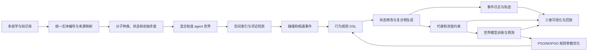

# 大肠杆菌多组学世界模型 Demo：设计与展示方案

> 文档状态：设计基线  
> 整理日期：2026-09-20  
> 适用对象：后续新对话、数据工程、仿真引擎、世界模型、可视化及云端部署工作  
> 核心定位：多组学先验驱动的粗粒化、事件驱动、可追溯世界模型，而不是完整真实细胞的逐分子复现

---

## 1. 结论摘要

本工作区已经具备较好的大肠杆菌多组学数据基础，可以启动一个最小 Demo。当前最适合实现的目标不是“模拟每一个真实分子”，而是：

```text
多组学来源
  -> 分子种类与状态
  -> 混合粒度 agent
  -> 三维空间与邻近检测
  -> 碰撞和相遇事件
  -> 状态修改、结合与新复合物
  -> 代谢浓度约束
  -> 世界模型预测
  -> 事件日志、回放与可视化
```

第一版 Demo 应证明以下链路可以运行、记录、回放和优化：

1. 每个 agent 能追溯到真实数据库和组学来源。
2. agent 能在空间中找到邻近对象，而不进行全量两两比较。
3. 相遇后能够执行无效果、修改、相互修改、结合、转换或解离等行为。
4. 邻居被修改时，双方都留下可追溯记录。
5. 结合后形成新的抽象质点，并拥有新的行为配置。
6. 代谢物浓度、质量和区室占位可以约束系统稳定性。
7. 相同输入、规则版本和随机种子可以复现相同事件序列。

当前不应宣称：

- 已复现某个真实大肠杆菌细胞的精确分子坐标。
- 已实现 261 万个分子的全动态真实模拟。
- 已具备可靠的未知生物学预测能力。
- 已覆盖全部基因组、全部蛋白质或全部代谢通路。

---

## 2. 工作区现状

### 2.1 已有数据资产

主要资产位于 `EcoliOmics/`。

| 项目 | 当前情况 | 对 Demo 的价值 |
|---|---:|---|
| 本地数据快照 | 2,039 个文件，14.25 GB，0 个哈希不稳定文件 | 可建立可追溯数据基线 |
| MG1655 参考 | GCF_000005845.2，UniProt UP000000625 | 提供基因和蛋白质实体编号 |
| 基因交叉映射 | 4,524 个位点，约 4,300 条 UniProt 映射 | 支撑统一实体编号 |
| RegulonDB | 109,831 行归一化记录 | 支撑转录调控规则 |
| iML1515 | 2,712 个反应、1,877 个代谢物、1,516 个基因 | 支撑代谢计量、边界和 FBA 基线 |
| 转录组和翻译组 | 已选择下载 MG1655 批次 | 支撑条件差异和翻译过程先验 |
| 蛋白质组 | 320 个 PRIDE 项目文件 | 可提取丰度先验，但需样本级清洗 |
| 代谢组 | 16 个 Workbench 研究，676 个样本，36,747 行 | 可提取浓度范围和扰动响应 |
| MetaboLights | 138 个研究的元数据包 | 可扩展代谢条件覆盖 |
| 集成样本表 | 602,778 行 | 结构已建立，条件字段待补全 |
| 集成实验表 | 606,392 行 | 结构已建立，跨组学匹配待补全 |

### 2.2 关键数据缺口

`EcoliOmics/reports/coverage/integration_gaps.md` 显示，当前样本条件字段完整度较低：

```text
condition   6.6%
genotype    4.0%
timepoint   0.01%
medium      0%
treatment   0%
replicate   0%
```

这意味着当前数据更适合建立“分子种类、互作拓扑和参考规则”，尚不足以稳定训练“特定培养条件到特定行为的条件化世界模型”。

其他数据问题包括：

- PRIDE 项目可能包含混合物种或非 MG1655 样本，必须按样本级别过滤。
- 不同代谢组研究的单位和归一化方法不同，部分为相对强度，部分为 `mM`。
- 部分数据许可状态为 `license_unverified`，云上公开部署前必须处理。
- ENA、PRIDE、RegulonDB 等数据仍需要保留来源版本和许可标签。

### 2.3 工程现状

当前工作区已经有数据下载、标准化和完整性校验脚本，但没有发现：

- agent 行为引擎。
- 空间碰撞和事件日志系统。
- 世界模型训练代码。
- PSO/MOPSO 规则优化代码。
- 可视化前端。
- 单元测试和系统测试。
- 顶层 Git 仓库。

因此下一阶段的主要工作应从“继续大规模下载”转为“建立可运行的最小仿真闭环”。

### 2.4 云端方案现状

工作区已有两套云上方案：

- `大肠杆菌云上最小Demo_全阿里云版.md`
- `大肠杆菌云上最小Demo_低成本实施方案.md`

这些方案认为：

- 数据、GPU、存储、镜像、日志和调度可以放在阿里云。
- Codex 控制面可以放在本地，通过 SSH、CLI、Git 和 OSS 操作云资源。
- 首年预算约为 3,000 至 18,000 元，取决于 T4/A10、运行时长、存储和网络。

新架构下需要调整资源假设：

- 数据工程和事件引擎以 CPU 为主。
- GPU 更适合世界模型的批量推理、图模型训练和参数搜索。
- 不规则事件队列通常仍需要 CPU 管理。
- 第一版不应默认采用大规模 GPU 训练。

---

## 3. 核心设计原则

### 3.1 混合颗粒度

不再强制为每个真实分子建立独立记录，而采用以下抽象：

| 对象 | 抽象方式 |
|---|---|
| 高丰度蛋白质 | 代表性 agent，携带 `copy_weight` |
| 低丰度蛋白质 | 独立 agent |
| 膜蛋白 | 膜表面上的二点五维 agent |
| DNA | 单个持久存储 agent，可附加多节点几何 |
| RNA | 按类型和状态建立 agent |
| 小分子 | 浓度场、池或代表性 agent |
| 脂质膜和 LPS | 光滑曲面、场或结构约束 |
| 复合物 | 新抽象质点，保留成员关系和历史 |

### 3.2 信息体与物理实体对应

对应关系必须定义在明确的抽象层级上：

```text
physical_entity
  <-> information_entity
  <-> represented_copy_count
  <-> state and behavior
  <-> provenance and uncertainty
```

一个 agent 可以代表多个真实拷贝。此时必须通过 `copy_weight`、`uncertainty` 和随机抽样明确表达一对多关系，不能把它误写成真实一一对应。

### 3.3 蛋白质的记忆与响应

蛋白质与忆阻器的类比适合作为抽象行为模型，不应直接实现成电路方程。

建议每个 agent 具有：

```text
state
input_context
history
transition_rule
output_action
memory_update
```

DNA 可以定义为高持久度、低响应速度的存储对象；RNA 可以根据类型定义为模板、调控或传递对象；蛋白质定义为多状态响应和执行对象。该分类应由行为属性决定，而不是只由分子名称硬编码。

### 3.4 世界模型

世界模型应建立在明确的实体、状态、邻域和事件之上，负责：

```text
当前状态 + 局域邻居 + 上下文
  -> 下一事件类型
  -> 状态变化
  -> 新实体或复合物
```

早期版本可以使用规则引擎产生训练数据，再由小型状态转移模型学习事件概率。世界模型不能替代事件记录和约束系统。

### 3.5 代谢组约束

代谢组数据适合作为稳定性、守恒和合理性约束，但不能单独决定所有行为规则。

建议约束包括：

- 区室浓度上下界。
- 质量和元素守恒。
- 反应方向和计量关系。
- 稳态漂移范围。
- 扰动后的恢复趋势。
- 对非物理参数组合的惩罚。

### 3.6 自然语言定义 behavior

大语言模型适合：

- 将专家描述转换为候选行为规则。
- 从多组学证据中解释相互作用。
- 生成人类可读的行为说明。
- 发现规则冲突和缺失先验。

大语言模型不适合：

- 直接控制每个碰撞数值。
- 未经校验直接修改核心状态。
- 替代计量、守恒和浓度约束。
- 在缺少来源时生成不可追溯规则。

推荐流程：

```text
自然语言行为
  -> LLM 结构化提取
  -> YAML/JSON 行为 DSL
  -> schema 校验
  -> 规则编译器
  -> 事件引擎执行
  -> 日志、验证和版本化
```

---

## 4. 总体系统架构



模块职责：

| 模块 | 职责 |
|---|---|
| 数据层 | 保存来源、版本、许可、哈希和标准化结果 |
| 实体层 | 定义分子种类、状态、定位和外部编号 |
| Agent 层 | 定义实例、拷贝权重、半径和行为配置 |
| 空间层 | 建立区室、膜曲面、空间索引和邻域列表 |
| 事件层 | 生成、排序、执行和记录相遇事件 |
| 规则层 | 保存自然语言来源、结构化条件和动作 |
| 世界模型层 | 预测事件和状态转移 |
| 约束层 | 执行代谢、质量、占位和浓度约束 |
| 优化层 | 使用 PSO/MOPSO 调整规则参数 |
| 展示层 | 三维场景、时间轴、对象检查和实验对比 |

---

## 5. 建议数据结构

### 5.1 `species`

```text
species_id
canonical_name
entity_type
external_ids
source_database
source_version
license_tag
compartment_prior
shape_model_id
confidence
```

`external_ids` 用于保存 UniProt、EcoCyc、RNAcentral、BiGG、PDB、AlphaFold 等编号。

### 5.2 `agent`

```text
agent_uid
species_id
state_id
x
y
z
r_eff
copy_weight
complex_uid
active
state_version
```

### 5.3 `behavior`

```text
behavior_id
source_text
structured_rule_id
trigger
preconditions
action_distribution
delay_model
constraints
provenance
confidence
```

### 5.4 `rule`

```text
rule_id
type_a
state_a
type_b
state_b
compartment
trigger_offset
action
probability
rate
output_type
cooldown
priority
```

### 5.5 `encounter`

```text
event_id
simulation_time
agent_a_uid
agent_b_uid
distance
rule_id
outcome
a_state_before
a_state_after
b_state_before
b_state_after
new_complex_uid
```

### 5.6 `complex`

```text
complex_uid
representative_x
representative_y
representative_z
r_eff
behavior_profile_id
component_count
created_event_id
```

### 5.7 `concentration`

```text
condition_id
compartment_id
metabolite_id
lower_bound
target_value
upper_bound
unit
source
confidence
```

---

## 6. 碰撞、行为和复合物

### 6.1 邻近检测

基础接触条件：

```text
d_ij <= r_eff_i + r_eff_j + delta_rule
```

其中：

- `r_eff` 是当前状态下的有效排除体积半径。
- `delta_rule` 是规则附加作用范围。
- 理想外切球半径只用于粗筛上界，不作为通用接触判据。

不应进行 261 万个 agent 的全量两两比较。建议使用：

- 空间哈希。
- 均匀网格。
- KD-tree 或 octree。
- Verlet 邻域列表。
- 膜表面的二维邻近索引。

### 6.2 行为类型

```text
NO_EFFECT
MODIFY_SELF
MODIFY_PEER
MODIFY_BOTH
BIND
TRANSFORM
DISSOCIATE
```

### 6.3 状态修改

修改邻居时，应记录：

```text
A_state_before
A_state_after
B_state_before
B_state_after
rule_id
event_id
simulation_time
```

不能只覆盖状态而不保留历史。

### 6.4 结合

```text
A + B -> C
```

处理规则：

1. A 和 B 保留记录，但标记为已结合。
2. 创建新的 `complex_uid C`。
3. C 获得位置、有效半径和行为配置。
4. C 作为新的抽象质点继续参与碰撞。
5. 如未来支持拆分，记录 `C -> A + B`。

---

## 7. 多组学到规则的映射

| 多组学来源 | 用于规则的内容 |
|---|---|
| 基因组和 UniProt | 实体编号、蛋白质序列和基础属性 |
| iML1515 | 反应、代谢物、计量、边界和 FBA 基线 |
| RegulonDB | 转录因子与靶基因调控关系 |
| 转录组 | 条件差异和共表达关系 |
| 翻译组 | 翻译活跃度和条件变化 |
| 蛋白质组 | 蛋白质丰度和状态先验 |
| 代谢组 | 浓度范围、稳态和扰动响应 |
| 复合物和互作数据 | 结合、聚集和复合物成员先验 |
| 定位数据 | 细胞质、周质、膜和类核分布 |
| 结构数据 | 有效半径、形状和方向 |

规则来源应分为：

```text
hard_prior       已知计量、定位和守恒
soft_prior       表达、丰度、互作和条件相关性
learned_rule     需要由模拟或优化确定的参数
```

每条规则都应保存来源、版本、置信度和适用条件。

---

## 8. 算法路线

### 8.1 Boid 的作用

Boid 可以借鉴：

- 分离。
- 聚集。
- 局部邻域。
- 连续运动趋势。

Boid 不应直接处理：

- 修改邻居。
- 形成复合物。
- 离散事件记录。
- 状态机转换。

### 8.2 PSO 的作用

经典 PSO 会向全局最优收敛，不适合直接控制所有分子位置。

建议采用双循环：

```text
内循环：agent 空间运动、邻近检测、碰撞、修改、结合
外循环：PSO/MOPSO 优化规则参数
```

外循环的适应度可以包括：

```text
代谢浓度合理性
蛋白和 RNA 分布一致性
复合物稳定性
条件扰动趋势
事件统计合理性
规则复杂度
```

世界模型和 PSO 的关系：

```text
规则引擎 -> 事件序列 -> 世界模型 -> 预测误差
                              |
                              v
                     PSO/MOPSO 调整规则参数
```

---

## 9. 第一版 Demo 范围

建议以大肠杆菌 MG1655 为对象，但只实现一个可解释子系统：

```text
中心碳代谢
+ lac 操纵子
+ 少量膜运输过程
```

推荐规模：

| 项目 | 建议值 |
|---|---:|
| 分子类型 | 40-80 |
| 每种分子状态 | 2-10 |
| agent 数量 | 2,000-20,000 |
| 行为规则 | 40-200 |
| 空间区室 | 胞外、周质、胞质、膜抽象面 |
| 空间分辨率 | 50-100 nm |
| 逻辑时间步 | 1,000-5,000 |
| 单次实验时间 | 30-120 分钟 |
| 随机种子 | 必须固定并可重放 |

如果目标是研究“最简单的完整生命体”，应优先考虑 Mycoplasma genitalium 或 JCVI-syn3.0。E. coli 更适合先做子系统 Demo，再扩展为全细胞框架。

---

## 10. Demo 预计实现的内容

### 10.1 实体与来源

- 每个实体拥有内部唯一编号。
- 每个分子种类可追溯到至少一个外部数据库编号。
- agent 保留初始丰度、定位、状态和来源置信度。

### 10.2 空间世界

- 杆状大肠杆菌空间。
- 胞外、周质、胞质和膜抽象面。
- 膜蛋白分布在膜表面。
- 不同类型的 agent 拥有不同粒度和有效半径。

### 10.3 行为引擎

- LLM 辅助生成候选行为 DSL。
- schema 校验和规则版本管理。
- 无效果、修改、相互修改、结合、转换和解离。
- 事件双方均可追溯。

### 10.4 世界模型

- 根据分子种类、状态、邻域和区室预测下一事件。
- 输出事件类别和状态变化概率。
- 与实际规则事件进行对照。

### 10.5 代谢约束

- 读取 iML1515 代谢计量。
- 读取代谢组浓度范围。
- 检测越界、质量不守恒和持续发散。
- 将失败结果反馈给规则优化器。

### 10.6 优化

- 使用 PSO/MOPSO 搜索连续规则参数。
- 保留规则版本、参数版本和最优解轨迹。
- 不把规则结构完全交给连续优化算法。

---

## 11. 展示方案

### 11.1 展示形态

建议使用全屏交互式三维场景，主要包括：

```text
Three.js 三维世界
FastAPI 仿真 API
WebSocket 事件流
Parquet/Zarr 轨迹存储
DuckDB 分析查询
Plotly 或同类图表展示浓度和指标
```

不建议第一版把 JupyterLab 直接暴露到公网。

### 11.2 界面结构

| 区域 | 展示内容 |
|---|---|
| 三维主视图 | agent、区室、膜面、事件高亮和复合物 |
| 对象检查器 | agent 编号、外部来源、状态、半径和历史 |
| 事件时间轴 | 相遇、修改、结合、解离和无效果 |
| 规则面板 | 规则来源、条件、动作、概率和置信度 |
| 浓度面板 | 关键代谢物当前值、正常范围和越界状态 |
| 对比面板 | 对照组和扰动组的轨迹及指标 |
| 回放控制 | 暂停、继续、单步、跳转和重放 |

### 11.3 Demo 演示脚本

1. 载入 MG1655 数据基线。
2. 显示初始 agent 数量、分子种类和数据来源。
3. 打开三维细胞，突出膜蛋白和小分子池。
4. 启动逻辑时间模拟，展示邻近搜索和碰撞。
5. 选择一次无影响碰撞，展示事件仍被记录。
6. 选择一次修改事件，展示邻居状态前后变化。
7. 触发一次结合，创建新复合质点并展示新行为。
8. 打开代谢浓度面板，展示范围和稳定性。
9. 施加葡萄糖限制或 lac 操纵子扰动。
10. 并排比较基线和扰动实验。
11. 用固定随机种子回放事件序列。
12. 展示世界模型预测与实际事件结果的差异。

---

## 12. Demo 验收标准

### 12.1 功能标准

- 所有 agent 和规则均可追溯到来源。
- 所有状态变化都有事件记录。
- 无效果、修改和结合三类事件可重现。
- 新复合物能继续参与后续事件。
- 相同输入和随机种子产生相同结果。

### 12.2 科学和约束标准

- 质量、数量和区室占位不出现明显非法状态。
- 关键代谢物浓度保持在设定范围内。
- 至少完成三组扰动。
- 与 FBA 或公开实验趋势进行对照。
- 所有失败案例和偏差都被保留。

### 12.3 工程标准

- 一条命令重建环境。
- 一条命令运行 Demo。
- 单次实验可在 30-120 分钟内完成。
- 代码、数据、容器和模型均可版本化。
- 对象存储和 Git 恢复流程经过演练。

---

## 13. 云端部署建议

推荐拓扑：

```text
本地 Codex 或受控控制节点
  -> Codeup 私有 Git
  -> 阿里云 CPU 控制面
  -> 按需 GPU 工作节点
  -> OSS 数据与模型桶
  -> ACR 镜像
  -> SLS 日志与审计
  -> RAM/KMS/STS 权限
```

资源分配：

| 工作负载 | 默认资源 |
|---|---|
| 数据工程 | CPU ECS |
| 事件驱动仿真 | CPU，优先高主频和内存 |
| 世界模型推理 | 按需 GPU |
| 模型训练 | 按需 A10 24GB 或同级 GPU |
| 可视化 API | CPU 控制面 |
| 大规模参数搜索 | 按需 GPU 或多进程 CPU |

第一年不建议：

- 一开始就租用 8 卡节点。
- 把 Jupyter 或数据库直接暴露到公网。
- 让长期空闲 GPU 保持运行。
- 把唯一数据副本放在实例系统盘。

---

## 14. 分阶段实施路线

### 阶段 0：文档和数据基线

交付：

- 冻结 Demo 范围和实体抽象层级。
- 固化 MG1655 参考、iML1515、RegulonDB 和组学快照。
- 建立 Git、许可清单和来源索引。

### 阶段 1：数据切片和统一编号

交付：

- 40-80 个分子种类。
- 统一外部编号。
- 样本条件清洗。
- 代谢浓度范围。
- 小型规则先验表。

### 阶段 2：碰撞和事件引擎

交付：

- 空间哈希。
- `r_eff` 邻域检测。
- 事件队列。
- 行为状态机。
- Parquet 事件日志。

### 阶段 3：混合粒度 agent 世界

交付：

- 代表性 agent 和 `copy_weight`。
- 膜表面 agent。
- 复合物生成和成员关系。
- 事件触发后的新行为。

### 阶段 4：LLM 规则和世界模型

交付：

- 自然语言到行为 DSL。
- schema 校验和版本管理。
- 小型状态转移模型。
- 预测误差报告。

### 阶段 5：代谢约束和优化

交付：

- iML1515 代谢约束。
- 代谢浓度上下界。
- PSO/MOPSO 参数搜索。
- 稳定性评分和失败案例。

### 阶段 6：云端部署和展示

交付：

- CPU 控制面。
- 按需 GPU 工作节点。
- 全屏三维展示。
- 事件回放。
- 对照组和扰动组比较。

---

## 15. 当前不确定性和风险

| 风险 | 影响 | 处理 |
|---|---|---|
| 条件字段缺失 | 无法可靠训练条件化规则 | 优先提取 BioSample 和样本属性 |
| PRIDE 混合物种 | 蛋白组先验被污染 | 样本级过滤和菌株校验 |
| 代谢单位不统一 | 浓度约束失真 | 标准化单位、提取方法和区室 |
| 许可未核实 | 阻止公开发布 | 建立许可白名单和隔离区 |
| 没有 Git 和测试 | 无法复现和审计 | 先建立版本控制和最小测试 |
| 规则欠定 | 多个规则集都能拟合数据 | 多目标约束和留出条件验证 |
| LLM 幻觉 | 生成不可验证规则 | DSL、schema、来源和置信度 |
| 尺度过大 | 无法交互运行 | 混合粒度和事件驱动 |
| GPU 误用 | 成本高但无收益 | 先测 CPU 事件引擎，再决定 GPU 训练 |

---

## 16. 明确不做的事情

第一版不实现：

- 261 万个真实分子的完整动态轨迹。
- 纳米级精确初始坐标。
- 全基因组所有分子种类。
- 飞秒到小时的全尺度物理模拟。
- 未知 ncRNA 的完整机制性规则。
- 用本系统替代实验验证。
- 用 LLM 直接决定所有生物行为。
- 把单一代谢数据作为唯一正确性来源。

---

## 17. 建议立即执行的下一步

1. 初始化顶层 Git 仓库并提交现有文档、脚本和配置。
2. 冻结 Demo 条件，例如 MG1655、富培养基和指数期。
3. 选择中心碳代谢、lac 操纵子和少量膜运输作为第一子系统。
4. 从 UniProt、iML1515、RegulonDB 和组学数据建立统一实体表。
5. 建立 agent、behavior、rule、encounter 和 complex 五类 schema。
6. 实现空间哈希、`r_eff` 邻域检测和事件日志。
7. 用 2,000 个 agent 跑通第一版无效果、修改和结合流程。
8. 再加入代谢浓度约束和三组扰动。
9. 最后接入世界模型、PSO/MOPSO 和三维展示。

---

## 18. 相关文件

### 数据与完整性

- `EcoliOmics/README.md`
- `EcoliOmics/reports/data_cards/ECOLI_OMICS_DATA_CARD.md`
- `EcoliOmics/reports/coverage/DATASET_STATUS.md`
- `EcoliOmics/reports/coverage/integration_gaps.md`
- `EcoliOmics/reference/reference_assets_manifest.json`
- `EcoliOmics/reference/BiGG/iML1515/bigg_model_metadata.json`

### 系统设计

- `虚拟细胞信息空间与AI动态仿真_可行性论证与核心挑战.md`
- `三维信息空间_质点模型_元胞自动机_可行性论证.md`
- `生物分子词表到频谱空间的映射方法.md`
- `AI驱动的生物方正系统的构建思路.txt`

### 云上部署

- `大肠杆菌云上最小Demo_全阿里云版.md`
- `大肠杆菌云上最小Demo_低成本实施方案.md`
- `阿里云首月GPU_ECS购买手把手.md`

### 可视化

- `visualizations/feasibility_viz.html`
- `visualizations/spectral_mapping_architecture.html`

