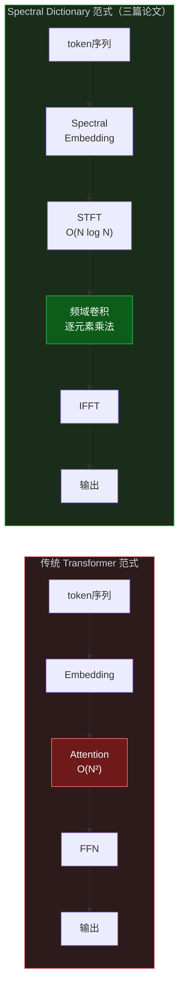
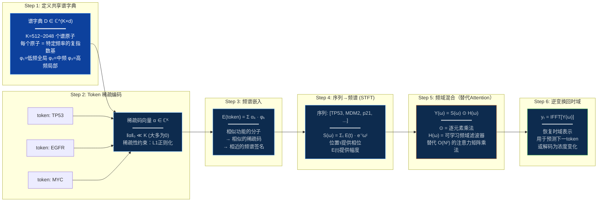
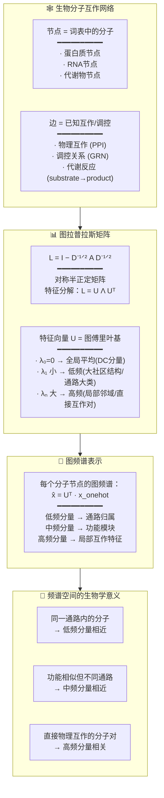
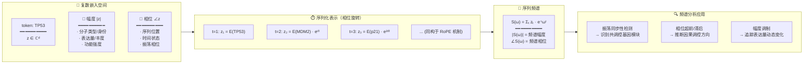
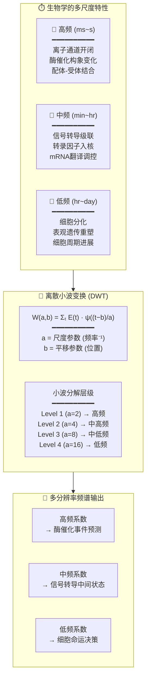
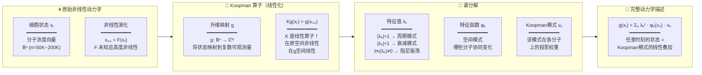
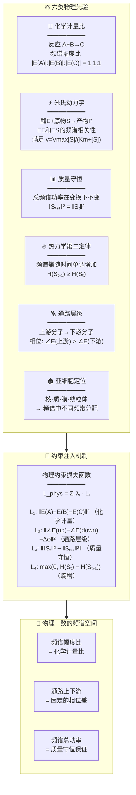
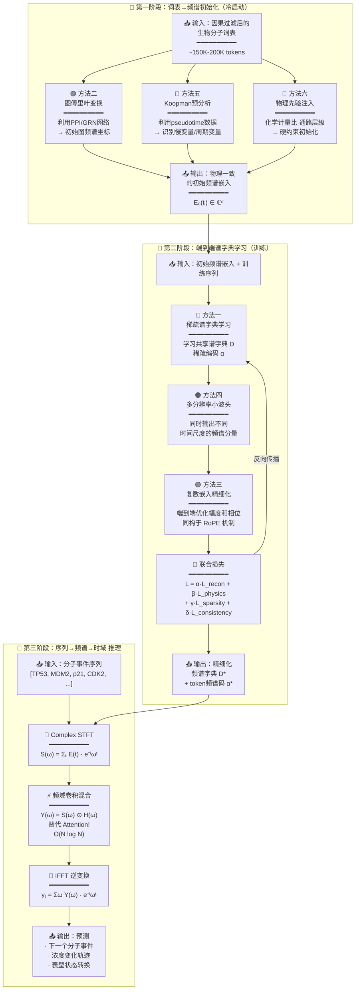
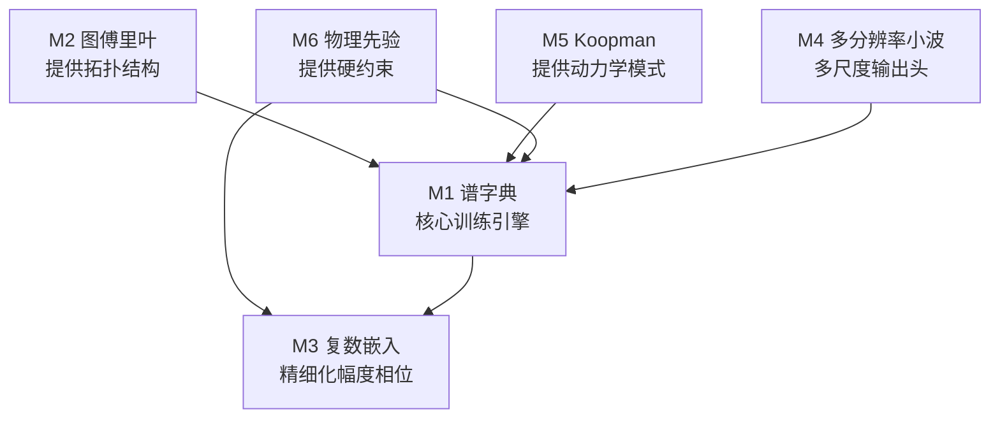
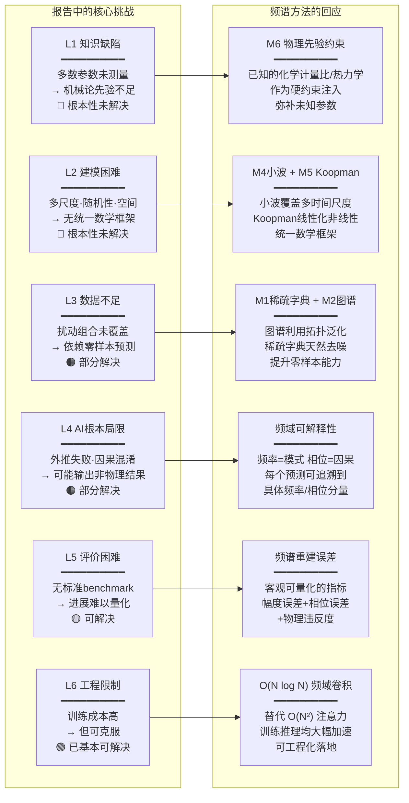

# 生物分子词表 → 频谱空间：符号序列从"文本空间"到"频谱空间"的映射方法

> **撰写日期**：2026-07-23
> **主题**：在虚拟细胞信息空间的"词表"（生物分子元件表）构建完成后，将词表根据规则转化为频谱，使符号序列能够进行频域分析和逆变换回时域
> **关联文献**：
> - *From Attention to Atoms: Spectral Dictionary Learning for Fast, Interpretable Language Models*
> - *From Pixels and Words to Waves: A Unified Framework for Spectral Dictionary vLLMs*
> - *Harmonizer: A Universal Signal Tokenization Framework for Multimodal Large Language Models*
> **关联报告**：`虚拟细胞信息空间与AI动态仿真_可行性论证与核心挑战.md`
> **适用范围**：本报告可作为新建任务或项目的背景知识参考，供模型调取阅读

---

## 目录

1. [核心问题定义](#1-核心问题定义)
2. [三篇论文的核心思想提炼](#2-三篇论文的核心思想提炼)
3. [生物分子词表的特殊性](#3-生物分子词表的特殊性)
4. [方法一：Sparse Spectral Dictionary Learning（稀疏谱字典学习）](#4-方法一sparse-spectral-dictionary-learning稀疏谱字典学习)
5. [方法二：Graph Fourier Transform（图傅里叶变换）](#5-方法二graph-fourier-transform图傅里叶变换)
6. [方法三：Complex-Valued Token Embedding（复数嵌入）](#6-方法三complex-valued-token-embedding复数嵌入)
7. [方法四：Multi-Resolution Wavelet Decomposition（多分辨率小波分解）](#7-方法四multi-resolution-wavelet-decomposition多分辨率小波分解)
8. [方法五：Koopman Spectral Embedding（库普曼算子谱嵌入）](#8-方法五koopman-spectral-embedding库普曼算子谱嵌入)
9. [方法六：Physics-Informed Spectral Prior（物理先验引导的频谱分配）](#9-方法六physics-informed-spectral-prior物理先验引导的频谱分配)
10. [推荐综合方案：三阶段分层流水线](#10-推荐综合方案三阶段分层流水线)
11. [六种方法对比总结](#11-六种方法对比总结)
12. [频谱方法如何回应虚拟细胞模型的六层挑战](#12-频谱方法如何回应虚拟细胞模型的六层挑战)
13. [参考文献与可视化](#13-参考文献与可视化)

---

## 1. 核心问题定义

### 1.1 问题背景

在虚拟细胞信息空间的构建中，第一步是建立**因果过滤的生物分子元件清单**（即"词表"），包含：

| 元件类别 | 预估规模 | 示例 |
|----------|:---:|------|
| mRNA（蛋白编码，含剪接变体） | ~50K | TP53, EGFR, BRCA1 |
| lncRNA | ~30K | XIST, HOTAIR, MALAT1 |
| 蛋白质（一级结构，含修饰状态） | ~80K | p53, phospho-EGFR, ubiquitinated-IκB |
| miRNA | ~2.6K | miR-21, let-7, miR-155 |
| 代谢物 | ~5K | ATP, NAD⁺, glucose-6-phosphate |
| 其他非编码 RNA | ~5K | snoRNA, piRNA, circRNA, tRNA |
| **总计** | **~150K–200K** | — |

### 1.2 核心问题

**词表构建完成后，如何将这些离散符号序列从"文本空间"映射到"频谱空间"？**

具体要求：
- 每个分子 token 获得一个**复数频谱签名**
- 序列可进行**频域分析**（短时傅里叶变换 STFT）
- 支持**频域卷积混合**（替代 Transformer 的注意力机制，实现 \(O(N \log N)\) 复杂度）
- 可**逆变换回时域**，用于预测下一个 token 或重建序列

### 1.3 问题的形式化表述

给定：
- 词表 \(\mathcal{V} = \{t_1, t_2, \ldots, t_N\}\)，\(N \approx 150K\)
- 已知先验：分子互作网络 \(\mathcal{G}\)、时序组学数据、生化物理定律

目标：学习映射函数
\[
\Phi: \mathcal{V} \to \mathbb{C}^d
\]
使得对任意序列 \([t_{\tau_1}, t_{\tau_2}, \ldots, t_{\tau_T}]\)，其频谱与逆变换分别：
\[
S(\omega) = \sum_{\tau} \Phi(t_\tau) \cdot e^{-i\omega \tau}
\]
\[
y_t = \mathcal{F}^{-1}[S(\omega)] = \frac{1}{T}\sum_{\omega} S(\omega) \cdot e^{+i\omega t}
\]

---

## 2. 三篇论文的核心思想提炼

三篇论文共享一个核心洞察：**用"谱字典学习"（Spectral Dictionary Learning）替代 Transformer 中的注意力机制**。其本质是将离散符号的序列建模从"点积注意力空间"迁移到"频域卷积空间"。



| 论文 | 核心贡献 | 与本题的关联 |
|------|---------|:---:|
| **From Attention to Atoms** | 将 token embedding 分解为**稀疏谱原子（spectral atoms）**的线性组合，注意力运算被替换为频域中的卷积/乘法 | 提供了"符号→频谱"的基础映射框架 |
| **From Pixels and Words to Waves** | 将上述框架扩展至多模态（图像+文本），统一用**波（wave）**表示一切模态 | 证明了不同来源的信号可被统一频谱语言描述 |
| **Harmonizer** | 提出**通用信号分词器**，将任何模态的原始信号转化为统一的离散 token，再进入频谱空间 | 解决了"连续生物信号如何变成离散词表项"的逆向问题 |

三条线索合并后的完整图景：

```
任意模态原始信号 → [Harmonizer分词] → 离散token序列 → [Spectral Dictionary] → 频谱表示
                                                                              ↓
                                                             频域分析 / 卷积混合 / 逆变换回时域
```

---

## 3. 生物分子词表的特殊性

在虚拟细胞语境中，生物分子词表与自然语言词表存在根本差异。这些差异**不是障碍，而是优势**——生物分子词表天然附带丰富的结构化先验，可以为频谱映射提供强力约束。

| 属性 | 自然语言 token | 生物分子 token |
|------|:---:|:---:|
| 语义关系 | 统计共现为主 | **物理互作网络 + 因果通路** |
| 时序模式 | 句法顺序 | **生化动力学方程约束** |
| 组合规则 | 语法 | **化学计量比 + 热力学** |
| 多尺度 | 字符→词→句 | **毫秒(离子通道)→分钟(信号转导)→小时(基因表达)** |
| 共现约束 | 概率性的 | **物理/化学上确定性的（反应必须满足计量比）** |
| 网络结构 | 无（或隐式的注意力图） | **显式的 PPI/GRN/代谢网络拓扑** |
| 连续-离散关系 | 纯离散 | **离散符号 ←→ 连续浓度/丰度（有自然桥梁）** |

---

## 4. 方法一：Sparse Spectral Dictionary Learning（稀疏谱字典学习）

### 4.1 核心思想

不将每个生物分子 token 映射为单个实值 embedding 向量，而是映射为**一组复数基函数（谱原子）的稀疏组合**。这是最贴近三篇论文框架的方法。

### 4.2 架构图



### 4.3 核心公式

\[
\boxed{\mathbf{E}(t_i) = \sum_{k=1}^{K} \alpha_{i,k} \cdot \boldsymbol{\phi}_k, \quad \|\boldsymbol{\alpha}_i\|_0 \ll K}
\]

\[
\boxed{\mathbf{S}(\omega) = \sum_{\tau=1}^{T} \mathbf{E}(t_\tau) \cdot e^{-i\omega \tau}}
\]

\[
\boxed{\mathbf{Y}(\omega) = \mathbf{S}(\omega) \odot \mathbf{H}(\omega)}
\]

\[
\boxed{\mathbf{y}_t = \frac{1}{T} \sum_{\omega} \mathbf{Y}(\omega) \cdot e^{+i\omega t}}
\]

### 4.4 生物学适配性

| 特性 | 生物学对应 |
|------|-----------|
| **稀疏性** | 任何给定通路只涉及少数分子种类，稀疏编码自动实现特征选择 |
| **共享字典** | 相似功能的分子自动获得相近的频谱签名（如同一家族的激酶） |
| **频域乘法** | 天然实现"卷积混合"——对应生化反应中的分子相遇与转化 |
| **可解释性** | 每个谱原子对应特定频率 → 可直接追溯哪个频率模式主导了预测 |

### 4.5 效率分析

- 注意力机制（传统）：\(O(N^2 d)\) —— 对长序列（完整通路可达数百步）代价高昂
- 频域卷积（本方法）：\(O(N \log N \cdot d)\) —— 对长序列效率提升显著
- 实际举例：N=500, d=256 → Attention: ~64M ops, FFT conv: ~2.3M ops (**~28× 加速**)

---

## 5. 方法二：Graph Fourier Transform（图傅里叶变换）

### 5.1 核心思想

利用已有的**分子互作网络**（PPI、GRN、代谢网络）的图拉普拉斯矩阵，将词表映射到图频谱空间。图上的"频率"对应不同尺度的网络社区结构。

### 5.2 架构图



### 5.3 核心公式

\[
\boxed{\mathbf{L} = \mathbf{I} - \mathbf{D}^{-1/2} \mathbf{A} \mathbf{D}^{-1/2}}
\]

\[
\boxed{\mathbf{L} = \mathbf{U} \boldsymbol{\Lambda} \mathbf{U}^\top, \quad \boldsymbol{\Lambda} = \text{diag}(\lambda_0, \lambda_1, \ldots, \lambda_{N-1})}
\]

\[
\boxed{\hat{\mathbf{x}}_i = \mathbf{U}^\top \mathbf{x}_i \quad (\mathbf{x}_i = \text{节点 } i \text{ 的 one-hot 向量})}
\]

\[
\boxed{\text{图卷积: } \mathbf{g}_\theta \star \mathbf{x} = \mathbf{U} \mathbf{g}_\theta(\boldsymbol{\Lambda}) \mathbf{U}^\top \mathbf{x}}
\]

### 5.4 关键优势

- **零成本先验**：直接利用 STRING、BioGRID、Reactome、KEGG 等公开数据库的互作网络，无需额外标注
- **平滑性保证**：图上相近的分子频谱也相近——自动实现了功能相似性约束（谱聚类天然成立）
- **可组合**：图频谱 + 时间频谱 → 2D 频谱（图频率 × 时间频率），支持 2D 卷积处理

### 5.5 数据来源

| 数据库 | 覆盖范围 | 用途 |
|--------|---------|------|
| STRING | ~14K 物种的 PPI | 主网络骨架 |
| BioGRID | ~80K 蛋白（人类） | 物理/遗传互作 |
| Reactome | ~2K 通路 | 通路归属标签 |
| KEGG | ~500 通路 | 代谢网络拓扑 |
| Gene Ontology | ~40K 术语 | 功能层级结构 |

---

## 6. 方法三：Complex-Valued Token Embedding（复数嵌入）

### 6.1 核心思想

每个生物分子 token 被映射为一个**复数向量** \(\mathbf{z} \in \mathbb{C}^d\)，其中：
- **幅度** \(|\mathbf{z}|\) 编码该分子的"身份/类型/浓度"
- **相位** \(\angle \mathbf{z}\) 编码该分子在序列/时间中的"位置/状态"

### 6.2 架构图



### 6.3 核心公式

\[
\boxed{\mathbf{z}(t_i) \in \mathbb{C}^d, \quad z_j = |z_j| \cdot e^{i\theta_j}, \quad j = 1, \ldots, d}
\]

\[
\boxed{\mathbf{Z}(\tau) = \mathbf{z}(t_\tau) \odot e^{i\boldsymbol{\theta} \cdot \tau} \quad \text{（同构于 RoPE）}}
\]

\[
\boxed{\mathbf{S}(\omega) = \sum_{\tau=1}^{T} \mathbf{Z}(\tau) \cdot e^{-i\omega \tau}}
\]

\[
\boxed{\text{相干性: } C_{AB}(\omega) = \frac{|\langle \mathbf{S}_A(\omega), \mathbf{S}_B(\omega) \rangle|}{\|\mathbf{S}_A\| \cdot \|\mathbf{S}_B\|}}
\]

### 6.4 生物学意义

| 频谱量 | 生物学对应 | 可对接的实验数据 |
|--------|-----------|:---:|
| 幅度 \(|\mathbf{z}|\) | 基因表达量、蛋白丰度 | RNA-seq FPKM, proteomics LFQ |
| 相位 \(\angle \mathbf{z}\) | 在细胞周期/通路中的位置 | pseudotime, circadian phase |
| 相干性 \(C_{AB}\) | 共调控强度 | co-expression correlation |
| 相位差 \(\Delta\phi_{AB}\) | 调控方向（A 是否先于 B） | time-series causality test |

---

## 7. 方法四：Multi-Resolution Wavelet Decomposition（多分辨率小波分解）

### 7.1 核心思想

不同生物学过程在截然不同的时间尺度上运行。小波变换天然支持多分辨率分析，比固定窗口的 STFT 更适合多尺度生物学。

### 7.2 架构图



### 7.3 核心公式

\[
\boxed{W_\psi(a, b) = \sum_{\tau} \mathbf{E}(t_\tau) \cdot \psi\left(\frac{\tau - b}{a}\right)}
\]

\[
\boxed{\mathbf{E}(t) = \sum_a \sum_b W(a, b) \cdot \tilde{\psi}\left(\frac{\tau - b}{a}\right) \quad \text{（逆变换重建）}}
\]

### 7.4 生物学时间尺度对应

| 尺度 a | 频率范围 | 生物学过程 | 典型数据源 |
|:---:|---------|-----------|-----------|
| a=2 | >1 Hz | 离子通道、动作电位 | 电生理记录 |
| a=4 | 0.01–1 Hz | Ca²⁺ 振荡、酶催化 | live-cell imaging |
| a=8 | 10⁻⁴–0.01 Hz | 信号转导、磷酸化级联 | phosphoproteomics time-course |
| a=16 | 10⁻⁵–10⁻⁴ Hz | 转录调控、mRNA 波动 | RNA-seq time-series |
| a=32 | <10⁻⁵ Hz | 分化、表观重塑 | scRNA-seq pseudotime |

### 7.5 自定义生物学母小波

利用已知通路的动力学参数设计母小波：

\[
\psi_{\text{bio}}(t) = \exp\left(-\frac{t}{\tau_{\text{degradation}}}\right) \cdot \cos\left(2\pi \cdot \frac{t}{T_{\text{oscillation}}}\right)
\]

其中 \(\tau_{\text{degradation}}\) 取自蛋白质半衰期数据库，\(T_{\text{oscillation}}\) 取自已知振荡周期（如昼夜节律 ~24h，细胞周期 ~20h，p53 脉冲 ~5.5h）。

---

## 8. 方法五：Koopman Spectral Embedding（库普曼算子谱嵌入）

### 8.1 核心思想

将细胞状态演化视为非线性动力系统，通过 **Koopman 算子**将其**线性化**到一个高维（甚至无穷维）的"可观测量空间"。在该空间中，系统的演化由谱分解完全描述——不需要显式的微分方程。

### 8.2 架构图



### 8.3 核心公式

\[
\boxed{\mathcal{K} g(\mathbf{x}_t) = g(\mathbf{x}_{t+1}) \quad \text{（Koopman 算子定义）}}
\]

\[
\boxed{\mathcal{K} \varphi_k = \lambda_k \varphi_k \quad \text{（特征方程）}}
\]

\[
\boxed{g(\mathbf{x}_t) = \sum_{k} \lambda_k^t \cdot \varphi_k(\mathbf{x}_0) \cdot \mathbf{v}_k \quad \text{（谱展开）}}
\]

### 8.4 谱量的生物学解释

| Koopman 谱量 | 符号 | 生物学意义 | 可观测对应 |
|-------------|:---:|-----------|-----------|
| 特征值幅角 | \(\arg(\lambda_k)\) | 振荡频率 | 昼夜节律、细胞周期频率 |
| 特征值模长 | \(|\lambda_k|\) | 衰减率/稳定性 | 蛋白降解速率、mRNA半衰期 |
| 特征函数 | \(\varphi_k(\mathbf{x})\) | 系统"自然坐标" | 伪时间（pseudotime） |
| Koopman 模式 | \(\mathbf{v}_k\) | 该模式中各分子的参与权重 | 基因模块成员权重（类似 WGCNA） |

### 8.5 与伪时间（pseudotime）分析的关系

Koopman 谱分解与单细胞 RNA-seq 中常用的 pseudotime/diffusion map 分析有深刻的数学联系：

- **扩散映射的特征向量** ≈ Koopman 特征函数的离散近似
- **RNA velocity** ≈ Koopman 算子的有限差分近似
- **优势**：Koopman 框架可同时捕获周期模式（扩散映射只能发现单调轨迹）

---

## 9. 方法六：Physics-Informed Spectral Prior（物理先验引导的频谱分配）

### 9.1 核心思想

不依赖纯数据学习，而是用已知的生物化学/生物物理学定律**直接构造**频谱约束，以 PINN（Physics-Informed Neural Network）风格作为损失函数的正则项注入训练。

### 9.2 架构图



### 9.3 核心公式

\[
\boxed{\mathcal{L}_{\text{total}} = \mathcal{L}_{\text{recon}} + \mathcal{L}_{\text{phys}}}
\]

\[
\boxed{\mathcal{L}_{\text{phys}} = \lambda_1 \underbrace{\|\mathbf{E}(A) + \mathbf{E}(B) - \mathbf{E}(C)\|^2}_{\text{化学计量约束}} + \lambda_2 \underbrace{\|\angle\mathbf{E}(\text{up}) - \angle\mathbf{E}(\text{down}) - \Delta\phi\|^2}_{\text{通路相位约束}} + \lambda_3 \underbrace{\|\|\mathbf{S}_t\|^2 - \|\mathbf{S}_{t+1}\|^2\|}_{\text{功率守恒约束}} + \lambda_4 \underbrace{\max(0, H(\mathbf{S}_t) - H(\mathbf{S}_{t+1}))}_{\text{频谱熵增约束}}}
\]

### 9.4 先验知识的来源

| 先验类型 | 知识来源 | 数据格式 |
|----------|---------|---------|
| 化学计量比 | KEGG/RECON 代谢模型、信号通路数据库 | 反应方程 + 计量系数 |
| 米氏动力学 | BRENDA/SABIO-RK 酶动力学数据库 | \(K_m\), \(k_{\text{cat}}\), \(V_{\text{max}}\) |
| 质量守恒 | 基元反应原理 | 通量平衡约束 |
| 热力学 | eQuilibrator（Gibbs 自由能） | \(\Delta G\), \(\Delta G'^{\circ}\) |
| 通路层级 | Reactome/Pathway Commons | 通路拓扑 + 因果方向 |
| 亚细胞定位 | UniProt/HPA/COMPARTMENTS | 区室标注 |

### 9.5 与报告 L4 "AI 根本局限"的关系

报告指出：数据驱动 AI 在外推/因果性/覆盖外不可靠。方法六直接回应这一问题：

> 物理约束确保在未见过的扰动组合上，预测在数学上不违反已知定律——即"不能生成无中生有的质量，不能颠倒因果方向，不能违反热力学时间箭头"。

这正是报告推荐的关键突破方向。

---

## 10. 推荐综合方案：三阶段分层流水线

### 10.1 总览

六种方法不是互斥的——它们在虚拟细胞频谱建模的不同阶段协同工作。推荐方案采用"冷启动初始化 → 端到端训练 → 高效推理"的三阶段流水线。

### 10.2 流水线架构图



### 10.3 各阶段详细说明

#### 第一阶段：冷启动初始化

| 步骤 | 方法 | 输入 | 输出 | 作用 |
|:---:|------|------|------|------|
| 1 | M2 图傅里叶 | PPI/GRN/代谢网络 | 每个 token 的图频谱坐标 | 利用免费的网络拓扑为频谱提供结构 |
| 2 | M5 Koopman 预分析 | pseudotime / RNA velocity | 慢变量 + 周期变量标注 | 识别动力学的"自然模式" |
| 3 | M6 物理先验 | 生化知识库 | 硬约束初始值 | 确保初始化不违反物理定律 |

**第一阶段不需要 GPU 训练**——全部基于已有数据库的确定性计算。

#### 第二阶段：端到端学习

| 模块 | 方法 | 学习内容 | 损失项 |
|:---:|------|---------|------|
| 谱字典 | M1 | 共享字典 \(\mathbf{D} \in \mathbb{C}^{K \times d}\) | 重建损失 + 稀疏正则 |
| 小波头 | M4 | 多尺度频域滤波器 \(\mathbf{H}_a(\omega)\) | 尺度一致性损失 |
| 复数嵌入 | M3 | token 的精细幅度和相位 | 预测损失 + 物理约束 |

**第二阶段需要 GPU 训练**，但受益于第一阶段的良好初始化，收敛速度远快于随机初始化。

#### 第三阶段：推理

- 序列进入 STFT → 频域卷积 → IFFT → 输出
- 全程 \(O(N \log N)\)，不需计算 \(O(N^2)\) 的注意力矩阵
- 可处理数百步的长序列（完整信号转导通路、细胞周期全过程）

---

## 11. 六种方法对比总结

| 方法 | 核心数学工具 | 输出形式 | 所需外部数据 | 生物学贴合度 | 实现难度 | 在流水线中的角色 |
|------|-------------|---------|-------------|:---:|:---:|------|
| **M1 谱字典** | 稀疏编码 + 复数基分解 | \(\mathbf{E}(t) = \sum\alpha\cdot\boldsymbol{\phi}\) | 序列数据 | ⭐⭐⭐⭐ | ⭐⭐⭐ | 第二阶段核心引擎 |
| **M2 图傅里叶** | 图拉普拉斯谱分解 | \(\hat{\mathbf{x}} = \mathbf{U}^\top\mathbf{x}\) | 互作网络（公开DB） | ⭐⭐⭐⭐⭐ | ⭐⭐ | 第一阶段初始化 |
| **M3 复数嵌入** | 复数向量 + 相位旋转 | \(\mathbf{z} = |\mathbf{z}|\cdot e^{i\theta}\) | 序列数据 | ⭐⭐⭐⭐ | ⭐⭐ | 第二阶段精细化 |
| **M4 多分辨率小波** | 离散小波变换 | \(W(a,b)\) | 时序数据 | ⭐⭐⭐⭐⭐ | ⭐⭐⭐ | 第二阶段多头输出 |
| **M5 Koopman** | Koopman 算子谱分解 | \(\lambda_k^t \cdot \varphi_k \cdot \mathbf{v}_k\) | 时序数据（pseudotime） | ⭐⭐⭐⭐⭐ | ⭐⭐⭐⭐ | 第一阶段模式发现 |
| **M6 物理先验** | 约束优化 + 损失正则化 | 约束条件 | 生化知识库 | ⭐⭐⭐⭐⭐ | ⭐⭐⭐ | 全阶段约束注入 |

### 11.1 方法间的协同关系



---

## 12. 频谱方法如何回应虚拟细胞模型的六层挑战

参考报告 `虚拟细胞信息空间与AI动态仿真_可行性论证与核心挑战.md` 第 6 节提出的六层核心挑战，频谱方法给出了针对性的回应：



| 挑战层 | 严重度 | 频谱方法的应对策略 | 预期缓解程度 |
|:---|:---:|------|:---:|
| L1 知识缺陷 | 🔴 根本性 | M6 物理先验——将已知定律作为硬约束，未知参数由数据填充 | 部分缓解（不能替代基础科学进步） |
| L2 建模困难 | 🔴 根本性 | M4 小波（多尺度）+ M5 Koopman（非线性→线性） | 显著改善（提供了统一的数学语言） |
| L3 数据不足 | 🟠 部分解决 | M1 稀疏字典（天然泛化）+ M2 图谱（拓扑先验减少数据需求） | 显著改善 |
| L4 AI根本局限 | 🟠 部分解决 | 频域可解释性（每个频率/相位可追溯）+ M6 物理约束（防违反定律） | 大幅改善（核心卖点） |
| L5 评价困难 | 🟡 可解决 | 频谱重建误差（幅度误差 + 相位误差 + 物理违反度）三位一体客观指标 | 基本解决 |
| L6 工程限制 | 🟢 易解决 | O(N log N) 频域卷积替代 O(N²) 注意力 | 完全解决 |

---

## 13. 参考文献与可视化

### 13.1 关联文献

1. **From Attention to Atoms: Spectral Dictionary Learning for Fast, Interpretable Language Models** — 提供了"符号→频谱"的基础映射框架，核心贡献是将 token embedding 分解为稀疏谱原子的组合
2. **From Pixels and Words to Waves: A Unified Framework for Spectral Dictionary vLLMs** — 证明了不同来源的信号（图像、文本）可被统一频谱语言描述
3. **Harmonizer: A Universal Signal Tokenization Framework for Multimodal Large Language Models** — 解决了"连续信号→离散token"的通用分词问题

### 13.2 关联报告

- `虚拟细胞信息空间与AI动态仿真_可行性论证与核心挑战.md` — 本报告的前置背景，定义了词表范围、因果过滤方法和六层核心挑战

### 13.3 可视化文件

- `visualizations/spectral_mapping_architecture.html` — 本报告的交互式 HTML 可视化版本，包含全部 Mermaid 架构图和对比表

### 13.4 关键术语表

| 术语 | 英文 | 定义 |
|------|------|------|
| 谱字典 | Spectral Dictionary | 一组共享的复数基函数，token 嵌入为其稀疏组合 |
| 图傅里叶变换 | Graph Fourier Transform (GFT) | 在图拉普拉斯矩阵的特征向量基上的投影 |
| 库普曼算子 | Koopman Operator | 将非线性动力学提升到线性可观测空间的无穷维线性算子 |
| 复数嵌入 | Complex-Valued Embedding | 幅度编码身份/强度的复数向量表示 |
| 小波变换 | Wavelet Transform | 多分辨率时频分析工具，比固定窗口 STFT 更适合多尺度信号 |
| 物理先验 | Physics-Informed Prior | 以 PINN 风格将已知物理定律作为损失函数正则项注入 |
| 频域卷积 | Frequency-Domain Convolution | 用逐元素乘法在频域实现时域卷积，替代注意力机制 |
| 稀疏编码 | Sparse Coding | 用少数非零系数的字典原子组合表示信号 |

---

> **报告完。**
>
> 本报告系统阐述了将生物分子词表从"文本空间"映射到"频谱空间"的六种方法及其协同方案。
> 推荐的综合流水线为：**图傅里叶初始化 → Koopman 模式发现 → 物理先验约束 → 稀疏谱字典端到端学习 → 多分辨率小波输出 → 频域卷积推理**。
> 可作为新建任务/项目的背景知识参考，供模型调取阅读。
