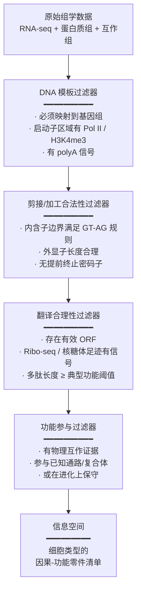
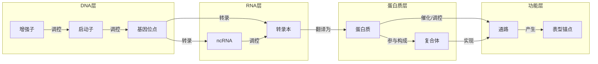
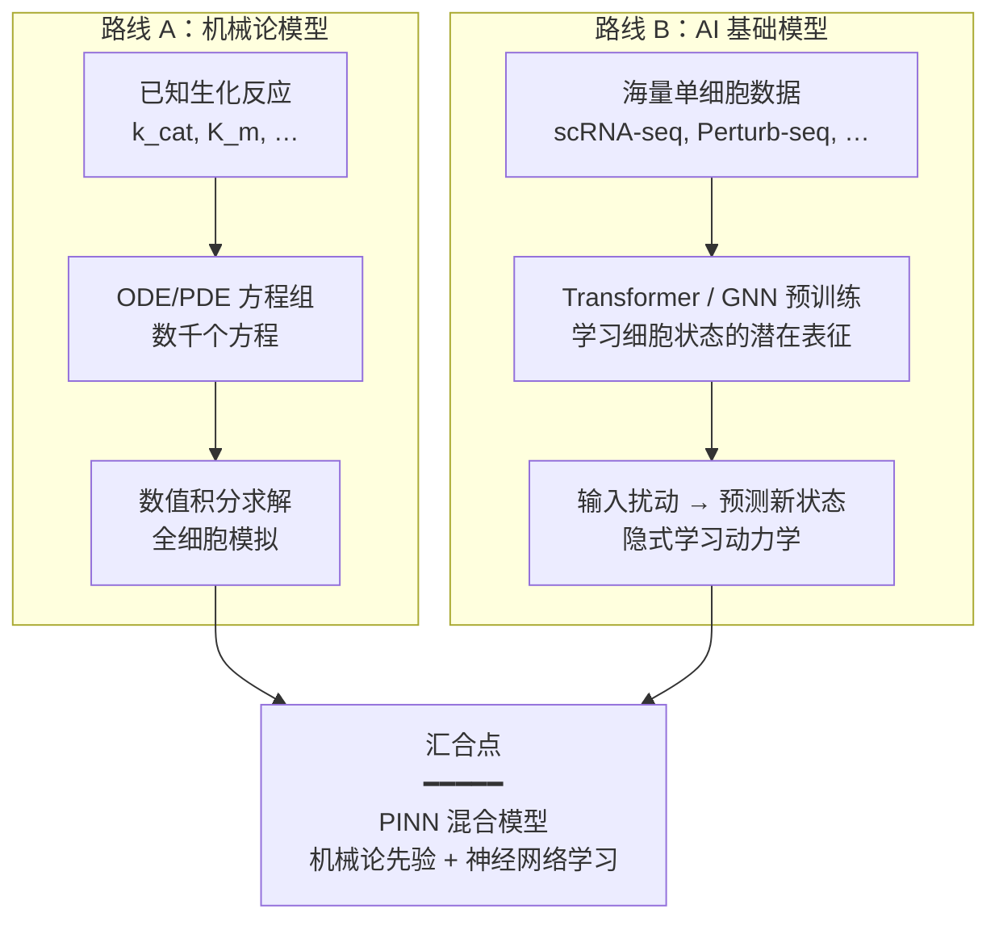
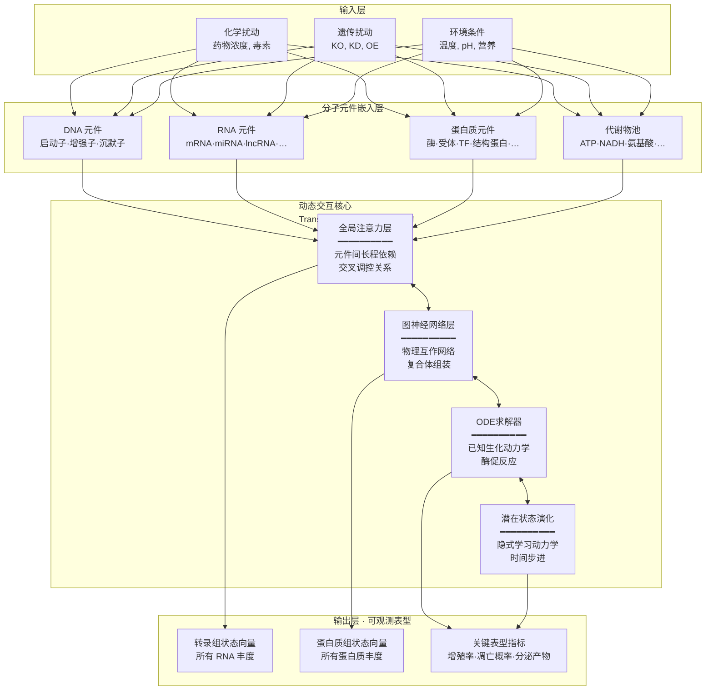
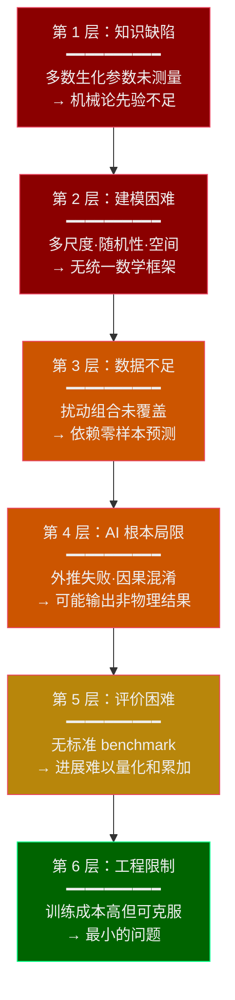
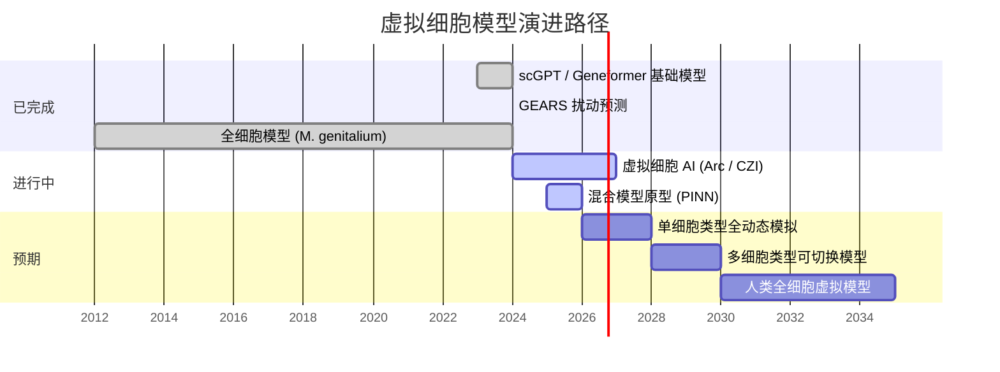

# 虚拟细胞信息空间与AI动态仿真 —— 可行性论证与核心挑战

> **撰写日期**：2026-07-22
> **主题**：从DNA信源穷举分子元件的可行性、因果过滤信息空间的构建、AI驱动的虚拟细胞动态仿真，以及当前面临的分层核心挑战
> **适用范围**：本报告可作为新建任务或项目的背景知识参考，供模型调取阅读

---

## 目录

1. [核心问题概览](#1-核心问题概览)
2. [问题一：从DNA序列穷举所有RNA与蛋白质的可行性](#2-问题一从dna序列穷举所有rna与蛋白质的可行性)
3. [问题二：基于重复观测逼近完备列举](#3-问题二基于重复观测逼近完备列举)
4. [问题三：因果过滤的信息空间构建](#4-问题三因果过滤的信息空间构建)
5. [问题四：AI驱动的虚拟细胞动态仿真](#5-问题四ai驱动的虚拟细胞动态仿真)
6. [核心问题的层次分析](#6-核心问题的层次分析)
7. [总览图：核心挑战与时间线](#7-总览图核心挑战与时间线)
8. [总结与展望](#8-总结与展望)

---

## 1. 核心问题概览

本报告探讨四个递进的问题：

| 序号 | 问题 | 结论 |
|:---:|------|------|
| 1 | 从DNA序列穷举所有可能被制造的RNA和蛋白质 | **不可行**（组合爆炸） |
| 2 | 依赖多组学重复观测是否可逼近完备 | **实用意义下可行**（存在根本边界条件） |
| 3 | 构建因果过滤的细胞零件清单信息空间 | **基本可行**（需精确定义阈值与离散度） |
| 4 | 融入AI大模型架构的虚拟细胞动态仿真 | **原则可行，正在发生**（面临六大层次挑战） |

---

## 2. 问题一：从DNA序列穷举所有RNA与蛋白质的可行性

### 2.1 结论：不可行

即使排除了转录/翻译错误、同分异构体和蛋白质高级结构，理论上从DNA能编码的RNA和蛋白质种类依然是天文数字，无法穷举。

### 2.2 核心障碍

#### 2.2.1 可变剪接的组合爆炸

人类约20,000个蛋白质编码基因中，绝大多数含多个外显子，可通过可变剪接产生多种mRNA异构体：

| 基因 | 机制 | 理论组合数 |
|------|------|:---:|
| Dscam（果蝇） | 互斥外显子的组合 | >38,000 |
| NRXN1-3（人类） | 多个可变剪接位点 | 数千 |
| 通用情况 | 10-30个外显子 × 包含/跳过 | \(2^n\) 级别 |

> 即使仅考虑已注释的可变剪接模式，组合数已使穷举成为 NP-hard 问题。

#### 2.2.2 免疫系统的体细胞重组

B细胞受体（免疫球蛋白）和T细胞受体（TCR）通过 V(D)J 重组产生：

- 人类 IGH 位点：44个V × 27个D × 6个J ≈ **7,000种** 基础组合
- 加上连接多样性（N-核苷酸添加、外切酶修剪）和体细胞超突变 → 理论库容 > **10¹¹**
- 重链+轻链配对 → BCR多样性可达 **10¹⁵** 或更高

这些重组发生在DNA层面，属于"以DNA为最终信源"的范畴。

#### 2.2.3 非编码RNA的庞大规模

| RNA类别 | 大致数量级 | 说明 |
|----------|-----------|------|
| mRNA（蛋白编码） | ~20,000基因 × N个剪接变体 | 可变剪接使数量难以界定 |
| lncRNA | >30,000基因（GENCODE） | 多数经历可变剪接 |
| miRNA | ~2,600成熟体（miRBase） | |
| snoRNA | >400 | |
| snRNA | ~20+主要类别 | |
| piRNA | >30,000簇 | 源自重复序列，边界模糊 |
| tRNA | ~500基因 / ~50种反密码子类型 | |
| rRNA | 4种（18S, 5.8S, 28S, 5S） | |
| circRNA | >100,000已检测的backsplice位点 | 由反向剪接产生 |
| eRNA（增强子RNA） | >40,000已注释的增强子区域 | 双向转录，边界模糊 |
| scaRNA, vault RNA, Y RNA, 7SK等 | 数个到数百 | |

#### 2.2.4 启动子和polyA位点的选择

- 许多基因有多个启动子（alternative promoters），产生不同的5'端
- 超过50%的人类基因有多个polyA位点（alternative polyadenylation）
- 这些与可变剪接叠加后，同一位点产生的转录本数量进一步爆炸

#### 2.2.5 "理论上可能" vs "实际被观测到"

如果"能被制造"指的是任何在理论上可由DNA序列通过转录/剪接机制产生的序列（即使从未在自然界被观测到），组合空间是纯粹的指数级爆炸——**不仅是工程上不可行，而是原则上不可穷举**。

---

## 3. 问题二：基于重复观测逼近完备列举

### 3.1 核心判断

| 目标 | 能否通过无限重复观测实现？ |
|------|:---:|
| 列举某个细胞类型中所有表达量高于阈值的RNA/蛋白质 | **可行**——积累曲线终将达到平台 |
| 列举"所有客观上被制造过的"RNA，不设阈值 | **理论上不可收敛**——采样越深发现越多，无自然下限 |
| 列举某种细胞在其所有可能状态下制造的RNA | **不可行**——状态空间连续，等价于组合问题 |
| 列举某种细胞的所有蛋白质（一级结构） | **更接近可行**——蛋白编码空间远小于RNA空间，但小ORF和稀有剪接异构体仍构成长尾 |

### 3.2 技术边界（可被突破）

| 限制 | 解决方案 |
|------|---------|
| 低丰度转录本检测不到 | 增加测序深度（单细胞 >10⁶ reads/cell 可行） |
| 稀有剪接事件漏检 | 长读长测序（PacBio、ONT）+ 靶向富集 |
| 低丰度蛋白质漏检 | 质谱灵敏度提升 + 单分子蛋白质测序（新兴） |
| 采样不足 | 增加生物学重复，从数十到数万个细胞 |

### 3.3 生物学边界：转录的"遍地"本质

ENCODE项目已证明：人类基因组的 **75-80%** 都能在某些细胞类型中被转录，尽管其中绝大多数转录本功能不明。随着测序深度增加：

- **低水平 pervasive transcription**：基因间区、重复元件、假基因都产生低丰度RNA
- **稀有剪接变体**：剪接体并非绝对精确，每个内含子都有微量"错误剪接"产物
- **单细胞水平的随机爆发**：转录爆发（transcriptional burst）使同一基因在细胞间呈ON/OFF随机状态

> "转录本种类数 vs 采样细胞数"的积累曲线可能永远不会真正达到平台——类似生态学中的物种累积曲线，尾部极长。

### 3.4 哲学边界：什么是"这一类细胞"？

**"一种细胞类型"不是自然界的离散实体，而是人类施加的分类标签：**

| 维度 | 连续变异 |
|------|---------|
| 空间位置 | 肝小叶的门静脉区 → 中央静脉区，基因表达是连续梯度 |
| 时间 | 细胞周期、昼夜节律、分化轨迹 |
| 微环境 | 邻近免疫细胞、氧张力、营养状态 |
| 随机性 | 同基因型、同环境下表达仍有显著随机波动 |

### 3.5 蛋白质方面是否更乐观？

相对更乐观，但仍有根本限制：
- 蛋白质编码基因仅约20,000个，远小于非编码RNA的来源
- 蛋白质的翻译调控更严格，不会出现大量"转录噪声"
- **但**：可变剪接产生不同蛋白异构体；RNA编辑（A→I、C→U）可改变编码序列；低水平翻译（非经典ORF、uORF）持续被Ribo-seq发现——这些小ORF翻译产物的总数随检测灵敏度提升仍在增长

---

## 4. 问题三：因果过滤的信息空间构建

### 4.1 核心构想

**追求实用意义上的完备**，充分考虑已知因果性规律，将一类相对离散的特定细胞群中参与连续互作的 ~99% 的RNA与蛋白质列出，通过因果过滤器（是否以DNA为信源制造、是否符合剪接规律等）去除无功能/破损分子元件，将所有零件装入一个**信息空间**。

### 4.2 规模评估

| 维度 | 数量级 | 数据库承载能力 |
|------|--------|:---:|
| 一特定细胞类型表达的基因 | ~10,000–14,000 | 微不足道 |
| 转录本异构体（含剪接变体） | ~25,000–50,000 | 微不足道 |
| 蛋白质种类（含异构体） | ~10,000–15,000 | 微不足道 |
| 合并后的独特分子元件 | ~35,000–65,000 | 微不足道 |
| 分子间互作关系 | ~10⁵–10⁶ | 完全可管理 |
| **总信息规模** | **< 10⁷ 条记录** | 一个小型PostgreSQL即可承载 |

### 4.3 因果过滤漏斗



### 4.4 各过滤层详情

#### ① DNA模板过滤器

筛掉：测序/建库artifact（引物二聚体、chimera）、环境中混入的RNA（细菌、病毒、培养基成分）

#### ② 剪接合法性过滤器

筛掉：稀有剪接错误产物（剪接体fidelity约10⁻³至10⁻⁵错误率）、内含子保留的无功能转录本、不完整的降解中间体

#### ③ 翻译合理性过滤器

筛掉：非编码RNA的随机短ORF翻译产物（<50 aa且无保守性证据）、假基因的无义翻译产物。**但保留**已验证的功能性小ORF（sORF/smORF）

#### ④ 功能参与过滤器——最关键的一层

筛掉：仅偶尔转录但不参与任何互作网络的分子、可检测但无功能的"乘客"RNA/蛋白。保留标准：≥1项物理互作证据（Co-IP、BioID、酵母双杂、交联质谱等）或 ≥1条通路归属证据

### 4.5 信息空间的知识图谱结构

每个节点携带：

- **身份**：序列、ID（Ensembl、UniProt等）
- **证据链**：通过了哪些因果过滤器
- **表达量**：在该细胞类型中的定量数据
- **互作边**：到其他节点的因果/物理连接



### 4.6 最接近该愿景的现有项目

| 项目 | 覆盖 | 差距 |
|------|------|------|
| **ImmGen** | 数百种免疫细胞类型的转录组 | 缺少蛋白质层和因果过滤 |
| **Human Protein Atlas** | 组织/细胞水平的蛋白表达 | 无互作层，无剪接异构体分辨 |
| **STRING** | 全基因组蛋白质互作预测 | 无细胞类型特异性，无因果精炼 |
| **Reactome + CellMap** | 细胞类型解析的通路 | 覆盖率不均匀，部分细胞类型稀疏 |
| **Tabula Sapiens** | 单细胞转录组图谱 | 仅RNA层 |
| **CPTAC** | 蛋白质组+基因组整合 | 仅肿瘤组织，未覆盖所有正常细胞类型 |

> **关键差距在于集成**：没有任何一个数据库同时做了**细胞类型分辨率 × RNA+蛋白质全覆盖 × 因果过滤器 × 互作网络**。

### 4.7 关键边界条件

| 边界条件 | 说明 |
|----------|------|
| 细胞类型的离散度 | 红细胞>静息T细胞>巨噬细胞>成纤维细胞（越离散越适合） |
| 蛋白质组覆盖度 | 当前质谱覆盖约8,000-12,000种蛋白，漏检率约20-30% |
| "99%"的操作定义 | 需明确是质量占比、通路覆盖还是概率置信度 |
| 单分子蛋白测序的成熟 | 填补低丰度蛋白空白的关键技术 |

---

## 5. 问题四：AI驱动的虚拟细胞动态仿真

### 5.1 终极愿景

> 在信息空间中仿真模拟出一个可以产生已知互作的虚拟细胞，在可接受的算力和时间周期中将所有已知分子元件参数化，深度融入大模型架构，对每次不同输入产生不同的关键参数响应——构建**细胞的AI数字孪生系统**。

### 5.2 可行性总体判断

| 目标 | 判断 |
|------|:---:|
| 静态零件清单 + 互作网络 | ✅ **已可实现** |
| 动态模拟，所有已知元件参与 | ⚠️ **正在突破** |
| 融入AI大模型架构 | ✅ **已有原型**（scGPT、Geneformer、scFoundation） |
| 输出含参模型，输入→不同响应 | ✅ **已有雏形**（GEARS、PINNACLE） |
| 实用算力 + 合理时间 | ✅ **单细胞类型可在一台GPU上运行** |
| 全细胞高保真模拟 | ❌ **尚未实现**，但并非原则上不可能 |

### 5.3 两条路线与汇合点



#### 路线A代表作：Karr实验室全细胞模型

- 对 **生殖支原体（*M. genitalium*，仅525个基因）** 构建了28个子模型的整合模拟
- 模拟了全部已知的DNA复制、RNA转录、蛋白质翻译、代谢通路
- 模拟一个细胞生命周期耗时约10小时（128核工作站）
- **局限**：525基因≠20,000基因；每个子模型需要手动parameterize

#### 路线B代表作

| 模型 | 架构 | 规模 | 核心能力 |
|------|------|------|---------|
| **Geneformer** | Transformer (6层, 12头) | 3000万单细胞, ~254M参数 | 基因剂量敏感性预测、疾病基因排序 |
| **scGPT** | 生成式Transformer | 3300万单细胞 | 细胞类型标注、扰动预测、多组学整合 |
| **scFoundation** | 大型Transformer (~100M参数) | >5000万单细胞 | 基因表达增强、药物反应预测 |
| **GEARS** | GNN + 跨基因嵌入 | Perturb-seq数据 | 预测未知遗传扰动的转录组响应 |
| **PINNACLE** | 上下文感知GNN | 156种细胞类型的蛋白互作网络 | 蛋白功能预测、治疗靶点发现 |

### 5.4 设想系统架构



### 5.5 当前全球竞争格局

| 团队 | 项目 | 策略 |
|------|------|------|
| **Arc Institute + Stanford** (Quake, Regev, Theis) | Virtual Cell Initiative | 大规模预训练 + 多模态数据 |
| **Chan Zuckerberg Initiative** | CZI Virtual Cell | 整合成像 + 组学 + 基础模型 |
| **Broad Institute** (Roohani, Leskovec) | GEARS → SATURN | GNN扰动预测 |
| **Karr Lab** (Mount Sinai) | Whole-Cell Modeling | 机械论模型向更大基因组扩展 |
| **DeepMind / Isomorphic Labs** | 未正式公布（AlphaFold 3已预测分子互作） | 结构为先的互作模拟 |

---

## 6. 核心问题的层次分析

从最底层到最顶层，逐层剖析虚拟细胞模型的实现障碍：

```
第 6 层：工程限制 ─── 可克服（最小的问题）
  ↑
第 5 层：评价困难 ─── 缺标准benchmark
  ↑
第 4 层：AI根本局限 ─── 外推失败·因果混淆
  ↑
第 3 层：数据不足 ─── 扰动组合未覆盖
  ↑
第 2 层：建模困难 ─── 多尺度·随机性·空间
  ↑
第 1 层：知识缺陷 ─── 多数生化参数未测量（最根本瓶颈）
```

### 6.1 第一层：知识完备性 —— 我们知道什么、不知道什么

#### 6.1.1 已测量参数 vs 未测量参数的鸿沟

**这是最根本的瓶颈**，直接决定了机械论约束的有效性。

| 参数类型 | 人类细胞中已测量 | 注释总数 |
|----------|:---:|:---:|
| 酶促反应 \(k_{cat}\) | ~8,000（BRENDA，全部物种） | ~30,000+ 种人类酶 |
| 酶促反应 \(K_m\) | ~2,000–3,000（多为体外，非细胞内条件） | 同上 |
| 蛋白-蛋白结合 \(k_{on}/k_{off}\) | 数百（方法一致性差） | >100,000 二元互作对 |
| 转录因子-启动子结合 \(K_d\) | 数百（ENCODE/DAP-seq多在非天然条件） | ~1,600 TF × ~20,000 启动子 ≈ 3×10⁷ 组合 |
| 蛋白质降解半衰期 | ~5,000（多在全细胞裂解液，非原位） | ~20,000 蛋白 |

> **参数测定的实验速度是线性的，而人类蛋白质组的规模使此问题不可能在单个实验室周期内完成。这不是工程瓶颈，是知识瓶颈。**

#### 6.1.2 条件依赖性

一个酶的 \(k_{cat}\) 在pH 7.0 vs 7.4、有/无拥挤效应（macromolecular crowding）、有/无翻译后修饰时，可变化2–10倍。几乎所有的测量参数都是去除条件依赖性的体外值——而细胞内条件随状态空间变化。

> **即使拥有了全部30,000个酶的 \(k_{cat}\)，仍需要知道它们如何随状态变化——使参数需求爆炸增长。**

---

### 6.2 第二层：动力学建模 —— 已知规律能否支撑动态模拟

#### 6.2.1 尺度鸿沟（Multi-scale problem）

| 事件 | 时间尺度 | 空间尺度 | 示例 |
|------|---------|---------|------|
| 蛋白质折叠/构象变化 | 10⁻⁶ – 10⁻³ s | nm | 变构调控、酶催化循环 |
| 基因转录 | 分钟 – 小时 | µm（染色质尺度） | 一个转录爆发持续约30 min |
| 蛋白合成 | 数分钟 | µm | 翻译一个400 aa蛋白约2 min |
| 细胞周期 | 10–30 h | 全细胞 | G1 → S → G2 → M |
| 分化/衰老 | 天 – 月 | 组织 | 干细胞 → 分化细胞 |

> **核心问题**：无法直接在一个统一的动力学框架中同时求解所有尺度——刚性（stiffness）使数值积分极其困难。Karr Lab采用模块化方法（每子模型独立时间步长），但导致模块间通信的误差累积。

#### 6.2.2 随机性 vs 确定性的悖论

| 方法 | 适用 | 不适用 |
|------|------|--------|
| ODE/PDE | 高丰度分子、连续变化 | 低丰度分子、离散事件 |
| Gillespie SSA | 低丰度分子、离散事件 | 高丰度分子、计算量爆炸 |
| 混合方法（τ-leap等） | 中等丰度 | 精度丢失、边界区域定义模糊 |
| 神经网络 | 灵活、可从数据学习 | 丢失可解释性和物理约束 |

> **Gillespie模拟的核心困境**：模拟500个通路的随机动力学在单细胞中需数天CPU时间。扩展到全人类细胞（~2×10⁴通路规模 × 随机性需要的多次采样）在计算上不可行。

#### 6.2.3 空间分隔

细胞不是一个搅拌良好的反应袋：

- **细胞核 vs 细胞质 vs 线粒体基质 vs ER内腔……**
- 蛋白质在分区间有精确的运输速率
- **相分离凝聚体**（LLPS droplets）创造新的伪分区

> **后果**：没有空间信息，仅依赖于全局平均浓度的模型会产生**10–100倍的数量级错误**。

---

### 6.3 第三层：数据量 —— 训练数据是否足够

#### 6.3.1 扰动空间的组合爆炸

当前最全面的扰动数据（Perturb-seq）覆盖了约10,000个基因的单独敲低。但细胞真实面对的是组合扰动：

- 2基因组合 = \(C(20000,2) \approx 2\times10^8\)
- 3基因组合 = \(C(20000,3) \approx 1.3\times10^{12}\)

> **不可能实验穷举**。模型必须学会零样本预测（在未见过的组合扰动上外推），当前AI模型在此任务上的表现仍不可靠。

#### 6.3.2 数据质量问题

- 不同实验室用同一方案 → 表达谱可有20–30%的非生物差异
- 同一实验室不同时间 → 仍有5–15%差异
- **这直接影响模型学到的是信号还是噪音**

#### 6.3.3 死数据 vs 活数据

几乎所有训练数据都是**静态快照**——一个时间点的表达谱。细胞动力学（time-series扰动数据）极其稀少：

- 少数time-course实验（如LPS刺激巨噬细胞、iPSC重编程）覆盖了部分状态转换
- 数据量远不足以训练全动力学模型

> **核心差距**：数据是照片集，我们需要一部电影。

---

### 6.4 第四层：模型架构 —— AI架构是否存在根本限制

#### 6.4.1 外推 vs 内插

当前AI模型（Transformer、GNN）本质上是**内插器**——在学习数据覆盖范围内表现良好，在覆盖范围外迅速退化：

| 任务 | 内插（数据覆盖内） | 外推（数据覆盖外） |
|------|:---:|:---:|
| 预测已见过细胞类型的表达 | ✅ 好 | — |
| 预测新的扰动组合 | ⚠️ 中等（GEARS级别） | 🔴 差 |
| 预测新细胞类型（全新分化状态） | — | 🔴 基本失效 |
| 预测跨物种 | — | 🔴 完全失效 |

> **虚拟细胞需要外推能力**——用户输入的扰动组合绝大多数不在训练集中。这是AI基础模型在生物学中面临的最严峻挑战。

#### 6.4.2 因果性 vs 相关性

一个典型问题：基因A和基因B的mRNA水平高度相关。模型学到了这个模式。敲低A → 模型预测B↓。但：

- 情形1（因果）：A是B的转录因子 → ✅ 正确
- 情形2（混淆）：A和B都受C调控 → ❌ 错误，敲低A不影响B
- 情形3（反向因果）：B调控A → ❌ 错误方向

当前基础模型无法自动区分这三种——因为学的是 \(P(\text{表达} \mid \text{上下文})\)，而非因果结构 \(P(\text{表达} \mid do(\text{扰动}))\)。

**需要的**：因果发现算法嵌入AI架构。代表性尝试：iVAE（identifiable VAE）、DAG-GNN，但尚未在规模上集成。

#### 6.4.3 参数量的悖论

- Geneformer：~254M参数
- scGPT：~51M参数
- GPT-4：~1.7T参数（估计）

人类细胞状态空间的潜在维度（有效自由度）估计在10³–10⁴量级（由scRNA-seq的PCA降维和autoencoder压缩推断）。这意味着**不需要数十亿参数**——可能10-100M参数的架构已经足够。这是好消息。

> 但模型参数 ≪ 有效数据量，否则只会记忆噪音。

---

### 6.5 第五层：验证与评估 —— 怎样才算成功

#### 6.5.1 "正确"的定义

| 验证方式 | 可行？ | 局限性 |
|----------|:---:|-------|
| 与保留测试集比较 | ✅ | 测试集与训练集同分布，不检验泛化能力 |
| 预测新实验 → 实验室验证 | ✅（循证） | 每个验证极其昂贵（~1-3万美元/实验） |
| 与已知文献对照 | ✅ | 出版偏倚——仅阳性结果被报告 |
| 模拟已知通路动力学 | ✅ | 通路层面仿真不能证明全细胞模型正确 |
| 模拟产物与物质守恒 | ✅ | 仅排除最粗的错误 |

#### 6.5.2 评价标准的缺乏

| 领域 | 标准评测 |
|------|---------|
| CV | ImageNet |
| NLP | GLUE / SuperGLUE |
| 结构生物学 | CASP |
| **虚拟细胞模拟** | **不存在公认benchmark** |

> 不存在标准任务、标准数据集、竞争评测——团队在各自范围内宣传"成功"，使进展难以量化和累加。

---

### 6.6 第六层：工程算力 —— 能否在实用范围内运行

#### 6.6.1 推理成本

假设虚拟细胞模型参数如下：
- 状态向量维度：~50,000
- 模型参数：~200M
- 时间步长：~1分钟，模拟1小时 = 60步

一次完整前向推理（200M参数Transformer，50K token输入）：**~0.1–1秒**（A100 GPU）
- 60步 ≈ **6–60秒**

> **推理不是瓶颈。完全可接受。**

#### 6.6.2 训练成本

- scGPT的训练：~7天，8×A100 GPU（估计）
- 加动力学训练数据（time-series losses）→ 可能需要数月
- 对一个团队（如CZI、Arc）**完全在预算内**

---

## 7. 总览图：核心挑战与时间线

### 7.1 核心挑战汇总



**颜色编码**：

| 颜色 | 含义 |
|:---:|------|
| 🔴 红 | **根本性未解决**——需要基础科学的进步 |
| 🟠 橙 | **部分解决**——有改进路径但需更多工作 |
| 🟡 黄 | **可解决**——已有思路但需标准化和共识 |
| 🟢 绿 | **已基本可解决**——在工程预算内 |

### 7.2 预期发展时间线



---

## 8. 总结与展望

### 8.1 信息完整性悖论

虚拟细胞模型的构建面临一个核心循环：

```
需要机械论模型 → 保证因果性和外推能力
       ↓
机械论模型需要完整参数 → 但永远不会有完整参数
       ↓
必须依赖数据驱动AI → 填补未知参数
       ↓
数据驱动AI在因果性/外推/覆盖外不可靠
       ↓
仍需机械论模型作为先验约束 ← (回到第一步)
```

### 8.2 突破之道

**物理信息神经网络（PINN）** 和 **混合神经符号学** 是打破循环的关键：

> 在已知参数的区域保持机械论精确性，未知区域用数据驱动的推断平滑过渡，且保证推断不违反已知物理/生物化学约束（守恒律、热力学第二定律、化学反应计量比）。

这正是2024-2025年前沿正在攻克的问题，尚未在单个人类细胞规模上被验证。

### 8.3 最终判断

| 目标 | 结论 |
|------|------|
| DNA→穷举所有分子元件 | ❌ **不可行**（组合爆炸，原则上不可穷举） |
| 组学数据→列举实际RNA/蛋白 | ✅ **可行**（有边界条件，设置阈值是关键） |
| 因果过滤→信息空间 | ✅ **基本可行**（对离散细胞类型尤其如此） |
| AI参数模型→虚拟细胞 | ✅ **原则可行，正在发生**（不是"能否"的问题，是"谁先做到"的问题） |
| 全细胞高保真全动态 | ⏳ **预计2030-2035**（需多层障碍逐步突破） |

---

> **报告完。**
> 
> 本报告整合了关于从DNA信源到虚拟细胞的全链条可行性论证，包括核心障碍的分层分析。
> 可作为新建任务/项目的背景知识参考。
